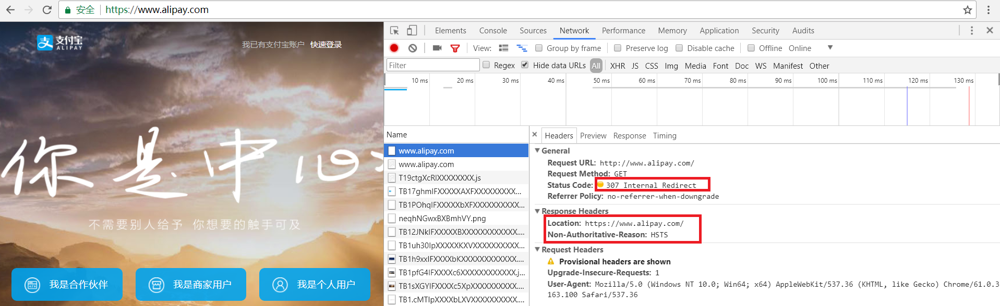
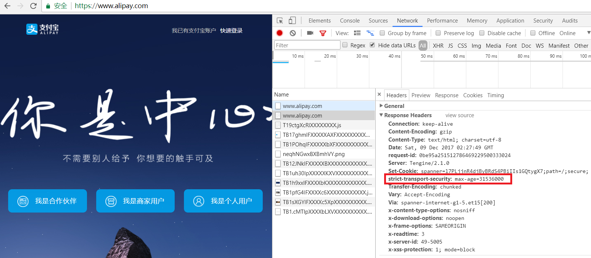
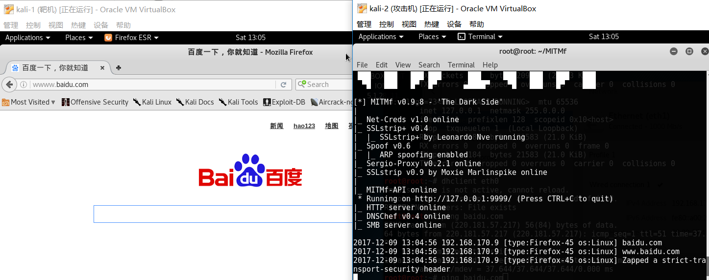
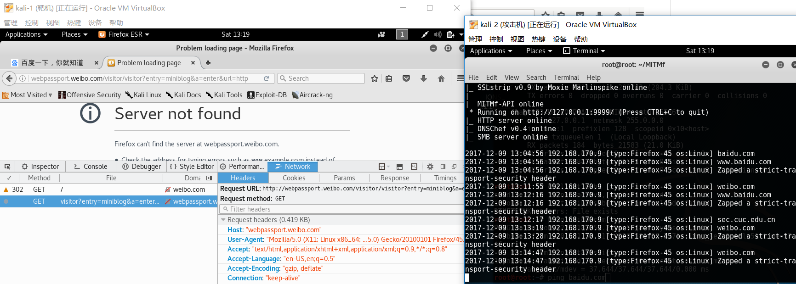
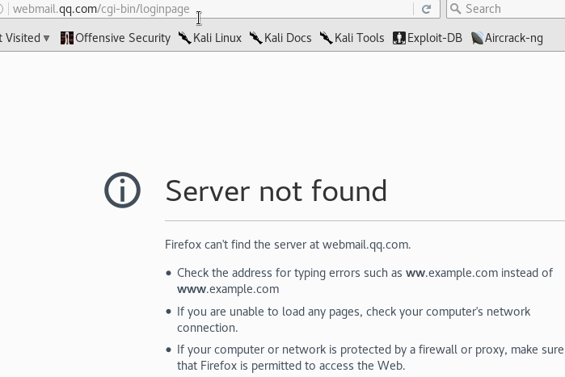
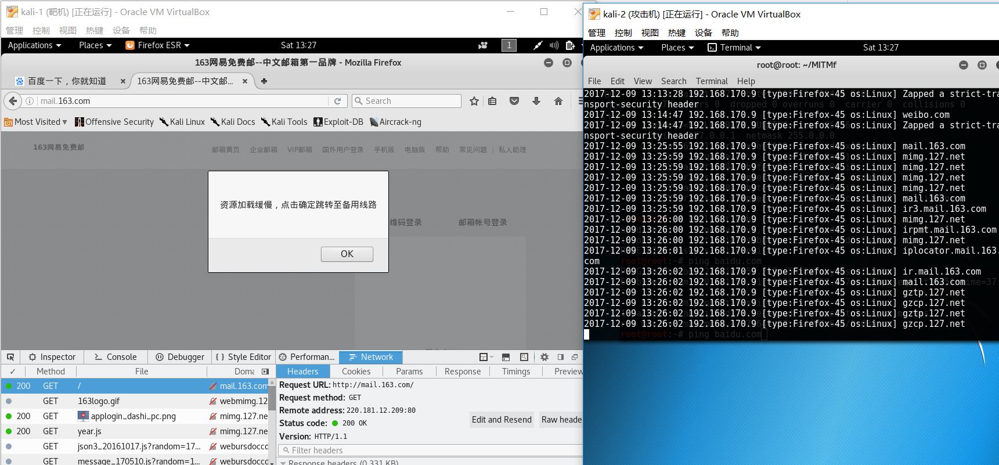
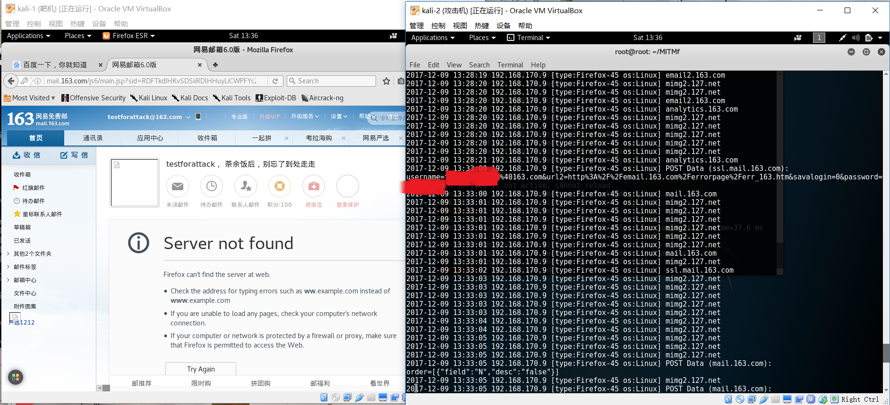
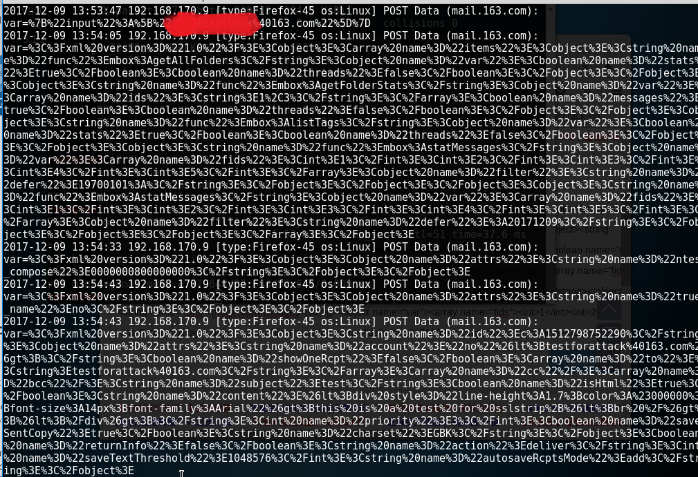
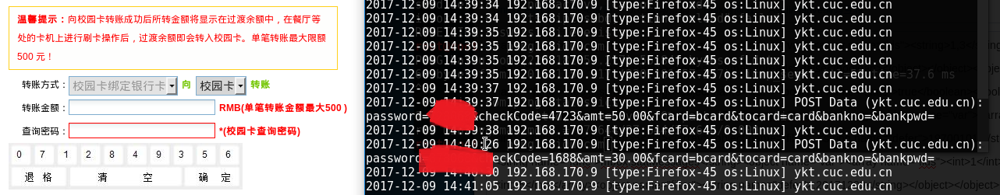

# 使用MITMf框架绕过HSTS（With Plugin SSLStrip+） #

## HSTS 概述 ##
采用HSTS协议的网站将保证浏览器始终连接到该网站的HTTPS加密版本，不需要用户手动在URL地址栏中输入加密地址。

该协议将帮助网站采用全局加密，用户看到的就是该网站的安全版本。

HSTS的作用是强制客户端（如浏览器）使用HTTPS与服务器创建连接。服务器开启HSTS的方法是，当客户端通过HTTPS发出请求时，在服务器返回的超文本传输协议响应头中包含Strict-Transport-Security字段。非加密传输时设置的HSTS字段无效。

比如，https://xxx 的响应头含有Strict-Transport-Security: max-age=31536000; includeSubDomains。这意味着两点：

在接下来的一年（即31536000秒）中，浏览器只要向xxx或其子域名发送HTTP请求时，必须采用HTTPS来发起连接。比如，用户点击超链接或在地址栏输入 http://xxx/ ，浏览器应当自动将 http 转写成 https，然后直接向 https://xxx/ 发送请求。如果 xxx 服务器发送的TLS证书无效，用户不能忽略浏览器警告继续访问网站

**具体的实现步骤如下：**

　　（1） 攻击者利用ARP欺骗等方式成功监听客户端； 

　　（2） 客户端向服务器端发送http请求，第三方攻击者如实转发请求； 

　　（3） 服务器端回复https链接给客户端，攻击者收到请求并将该链接篡改为http链接回复给客户端； 

　　（4） 客户再次发送http请求给服务器端，攻击者将其改为https发送至服务器端； 

　　（5） 至此，客户端与攻击者就建立了一个http明文链接，攻击者与服务器端建立了https加密链接，客户端的所有信息都暴露在了攻击者的视野之下。 

## MITMf SSLStrip+ 攻击 ##

### 攻击baidu.com ###

www.baidu.com 被增加一个'w'，使得DNS不知道如何处理。这时候，攻击者将请求重定向到他自己以前设置的DNS代理，该代理将响应所请求页面的HTTP版本，基本上劫持地址解析。

### 攻击微博weibo.com和qq邮箱 ###

微博weibo.com和qq邮箱会被重定向到一个新的url

然而，找不到 webpassport.weibo.com 和 webmail.qq.com 的服务器 DNS 地址。

### 攻击163邮箱 mail.163.com ###

网易163邮箱服务器有备用的地址，进行MITMf SSLStrip+ 攻击后，会提示“资源加载缓慢，点击确定跳转至备用线路”。

点击OK使用备用线路，这时候受SSLStrip+攻击，登录邮箱时，即使勾选“全程ssl”，也还是http传输，用户名和密码将会暴露给中间人。

由于163邮箱内容是http传输，受害者发送的邮件都会被劫持到。

### 攻击cuc校园卡充值页面 ###

由于密码按键是需要根据前端js渲染出来的，每次刷新页面数字出现的位置随机，因此，中间人想要推测出用户输入的密码，还需要查看js代码

### 防范MITMf SSLStrip+ 攻击 ###

手动在地址栏输入https才不会受到SSLStrip+ 攻击，才能正常访问页面。即使存在中间人，中间人也看不见传输的数据。

并且在页面上输入用户名和密码时，需要注意地址栏的url是否是https，或者www是否又被添加了一个“w”。

## HSTS 分析 ##

网易邮箱整个网站属于HTTP 和 HTTPS 混合部署。混合部署的一个严重的问题是Cookie的保密性和完整性难以保证。Cookie 通常用于存储认证和会话管理等重要的信息，在浏览器与服务器之间按照同源策略（SOP） 进行传输。Cookie 的 SOP 仅由 Domain 和 Path 属性确定而与协议无关，于是 HTTPS 会话中的 Cookie 有可能在 HTTP 会话中被泄露。

虽然网易邮箱的站点混合部署HTTP和HTTPS内容，但是在一般的使用情况下，为了防止包含敏感信息的Cookie在HTTP会话中被泄露，站点应该使用secure cookie,客户端只有在使用SSL和HTTPS协议发出请求时，才能把Cookie发送到服务器。通过网易邮箱的实验可以确定的是，不应在HTTP cookie中存储或传输机密或敏感信息。

从《SSLStrip 的未来——HTTPS 前端劫持》这一文章中获知，在浏览网页的过程中，客户端依次收到各个数据块，最终才能合并成一个完整的网页。而中间人通常先收集数据，等到页面接收完整，才开始替换，这种工作方式容易造成操作超时。

由于 HTML 兼容众多历史遗留规范，因此替换工作并非是件轻松事。各种复杂的正则表达式，消耗着不少的 CPU 资源。尽管用户最终点击的只是其中一两个链接，但中间人并不知道将会是哪个，因此仍需分析整个网站的页面。

## 参考资料 ##
[https://github.com/byt3bl33d3r/MITMf](https://github.com/byt3bl33d3r/MITMf)

[Defeating HSTS and Bypassing HTTPS with DNS Server Changes and MITMf](https://null-byte.wonderhowto.com/how-to/defeating-hsts-and-bypassing-https-with-dns-server-changes-and-mitmf-0162322/)

[百度百科 HSTS](https://baike.baidu.com/item/HSTS/8665782?fr=aladdin)

[使用MITMf框架绕过HSTS（With Plugin SSLStrip+）](https://github.com/CUCCS/ns/blob/2016-2/2016-2/zzj_cay/TASK.Exploration_and_experiments_on_SSL_MITM_attacks/%E6%8B%93%E5%B1%95%E5%AE%9E%E9%AA%8C1.md)
