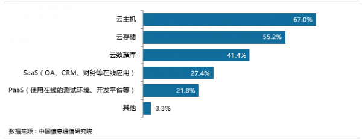
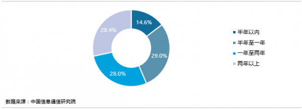
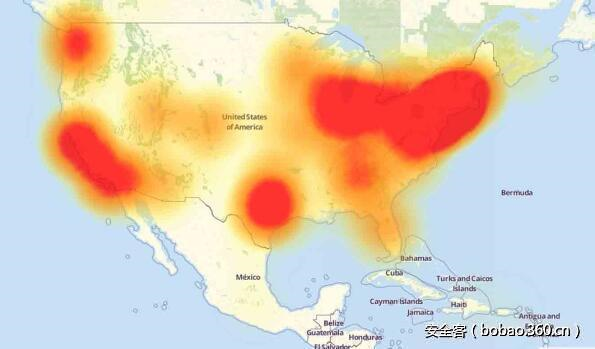

### 2016年网络安全大事记
这一年，关键性基础设施成为黑客攻击的新目标。回顾这一年发生的重大网络安全事件，黑客关注的不仅仅是各种核心数据的窃取，更多的是针对一些关键性基础设施，政府、金融机构、能源行业都成为了黑客攻击新的目标。

以下是2016年`全球`发生的比较有影响力的安全事件
>来源：IT168网络安全频道 http://safe.it168.com/a2016/1219/3069/000003069690.shtml

* 事件一：俄罗斯央行遭黑客攻击 3100万美元不翼而飞

  

  12月，俄罗斯中央银行官员瑟乔夫证实，该行电脑系统遭到了黑客入侵，犯罪分子从银行的代理账户中窃走了20亿卢布(约合3100万美元)的资金。瑟乔夫透露，黑客是通过伪造一名用户的证书进入的这些账户。紧接着，俄罗斯第二大银行VTB再遭黑客攻击，幸运的是，银行方面的防御体系成功击退了指向其业务系统的DDoS攻击，未造成资金损失。

* 事件二：德国90万家庭断网 遭黑客蓄意入侵

  11月，德国电信遭遇一次大范围的网络故障。2000万固定网络用户中的大约90万路由器发生故障(约4.5%)，并由此导致大面积网络访问受限。德国电信进一步确认了问题是由于路由设备的维护界面被暴露在互联网上、并且互联网上正在发生针对性的攻击而导致。
* 事件三：旧金山地铁被勒索软件攻击 乘客免费乘坐地铁

  

  11月，旧金山的Municipal地的电脑票价系统遭到黑客攻击，黑客索要100比特币作为赎金。尽管旧金山地铁没有公布案件调查进展信息，但我们能从中看出这是一次恶意的黑客勒索软件攻击事件，若要恢复地铁票价系统就需要进行比特币赎金交易。尽管黑客已经开设好比特币钱包等待旧金山地铁的支付，但旧金山地铁并未向黑客支付任何费用，在所有地铁购票机器工作失常后，旧金山地铁干脆开放地铁，允许乘客免费乘坐。
* 事件四：美国遭史上最大规模DDoS攻击、东海岸网站集体瘫痪

  

  10月，恶意软件Mirai控制的僵尸网络对美国域名服务器管理服务供应商Dyn发起DDoS攻击，从而导致许多网站在美国东海岸地区宕机，如GitHub、Twitter、PayPal等，用户无法通过域名访问这些站点。事件发生后，360与全球安全社区一起参与了这次事件的追踪、分析、溯源和响应处置，利用360公司的恶意扫描源数据，率先发现并持续追踪溯源了这个由摄像头等智能设备组成的僵尸网站。360也是唯一参与全球协同处置该事件的中国机构。

* 事件五：美国国家安全局陷入斯诺登之后最大泄密风波

  

  继斯诺登泄密风波之后，美国国家安全局(NSA)再次敲响内部威胁警钟。NSA承包商哈罗德?马丁于8月27日因窃取国安局数据被捕，马丁与曾揭露美国政府大规模监听行动的斯诺登受雇于同一家公司，马丁还被怀疑掌握了NSA的“源代码”，这些源代码通常被用来入侵俄罗斯、中国、伊朗等国的网络系统。调查人员在马丁家中和车内搜出美国政府高度机密文件的复印文本和数字文档，其中数字文档至少有几TB，还包括6份“敏感情报”。美国司法部检察官说，如果在未经授权的情况下泄露这些高度机密文件，美国国家安全将遭受“极为严重”的损害。

* 事件六：`希拉里邮件门事件`

  

  2015年年初，邮件门事件首次被曝光，希拉里在2009年至2013年担任美国国务卿期间，违规使用私人电子邮箱和位于家中的私人服务器收发大量涉密的邮件. 涉嫌违反美国《联邦档案法》，面临调查时又匆匆删除。2016年夏季，美国民主党全国委员会、筹款委员会、竞选团队被黑客组织入侵，近2万封邮件被维基解密披露。邮件显示，希拉里涉嫌抹黑竞争对手，以及可能涉嫌洗钱等财务问题。10月28日，大胖子黑客Kim Dotcom翻出了被希拉里删除的邮件，导致FBI重新开始调查希拉里邮件门事件，这对于大选前夕的希拉里来说，频发传出的负面消息导致曾人气领先的希拉里惜败。

以下是2016年`中国`发生的比较有影响力的安全事件
>http://www.maigoo.com/news/474064.html

* 315晚会曝光公共WIFI漏洞

  

  消费者权益保护日当天，央视315晚会曝光公共WIFI有安全漏洞，不法分子可提取登录用户手机中包括手机号码、家庭住址、身份证号甚至银行卡号等个人隐私信息。一旦个人隐私信息被盗取，将会被不法分子利用，进行个人钱财转移或盗取操作，造成巨大的人身财产损失。

* 新型安全漏洞水牢漏洞威胁我国十余万家网站

  

  开源的加密工具OpenSSL继“心脏出血”漏洞事件后，又被爆出新的安全漏洞“水牢漏洞”，这一漏洞允许“黑客”攻击网站，并读取密码、信用卡账号、商业机密和金融数据等加密信息。全球有三分之二的网站服务器都是用OpenSSL的软件加密，因此，安全漏洞也易对全球网站产生巨大的安全考验。据悉，这次安全漏洞涉及了全球400万家网站和服务器，其中，我国有十万余家网站受到影响。幸运的是，“水牢漏洞”利用难度大，攻击成本高，因此不会发生严重的信息泄露事件，再加上OpenSSL及时发布了官方补丁，网站及时更新就能封住这一漏洞。

* 《网络安全法》正式通过

  

  十二届全国人大常委会第二十四次会议高票通过了《中华人民共和国网络安全法》，并将于2017年6月1日起正式施行。历时两年三审之后，我国首次从立法层面确立了安全在整个信息系统建设中的核心和关键地位。从企业自发重视上升到法律强制推行后，网络安全相关产业市场空间有望迎来加速增长。《网络安全法》共有7章79条，内容上有六方面突出亮点：第一，明确了网络空间主权的原则；第二，明确了网络产品和服务提供者的安全义务；第三，明确了网络运营者的安全义务；第四，进一步完善了个人信息保护规则；第五，建立了关键信息基础设施安全保护制度；第六，确立了关键信息基础设施重要数据跨境传输的规则。《网络安全法》的制定出台，是贯彻落实网络强国战略的重要一环，将有力地促进并服务于“互联网+”行动和网络强国战略的进一步实施。对于完善我国在网络空间的规范治理体系具有基础性意义。
