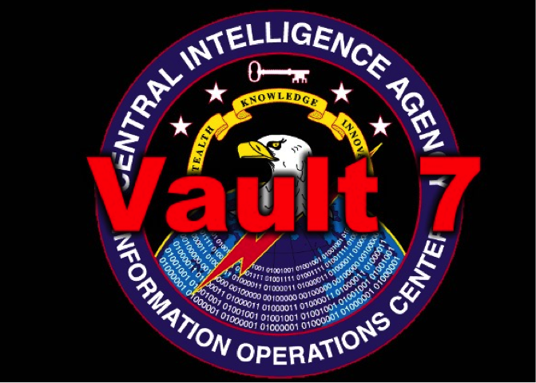
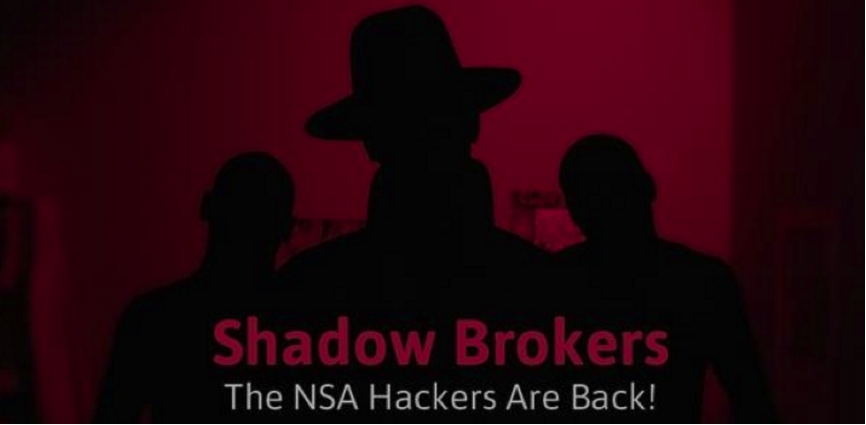
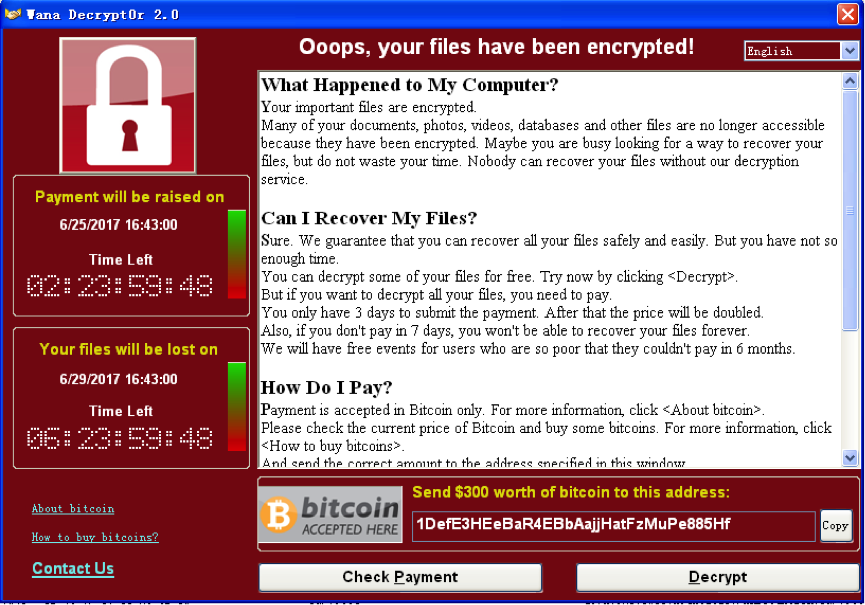
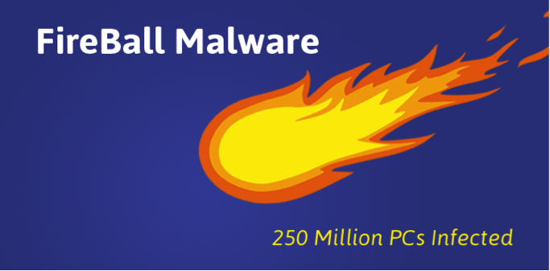
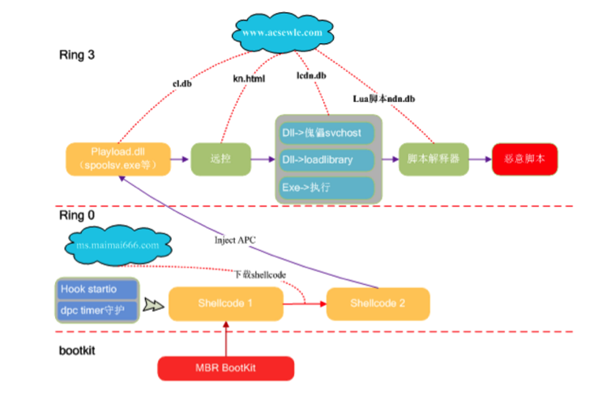

### 2017年网络安全大事记
以下是2017年上半年`全球`发生的比较有影响力的安全事件
>来源：腾讯新闻http://www.qq.com/a/20170804/032229.htm

* 事件一：维基解密CIA绝密文件泄露事件

  

  2017年3月7日，维基解密（WiKiLeaks）公布了数千份文档并揭秘了美国中央情报局关于黑客入侵技术的最高机密，根据泄密文档中记录的内容，该组织不仅能够入侵iPhone手机、Android手机和智能电视，而且还可以入侵攻击Windows、Mac和Linux操作系统,甚至可以控制智能汽车发起暗杀活动。外界将此次泄漏事件取名为Vault 7，Vault 7公布的机密文件记录的是美国中央情报局（CIA）所进行的全球性黑客攻击活动。

  Vault7包含8761份机密文档及文件，这些文件记录了CIA针对Android以及苹果智能手机所研发的入侵破解技术细节，其中有些技术还可以拿到目标设备的完整控制权。维基解密创始人阿桑奇表示，文件显示出“CIA网络攻击的整体能力”，而维基解密在发布这些文件时声称“CIA的网络军械库已失控”。

* 事件二：影子经纪人公开NSA（美国国家安全局）黑客武器库

  

  2017年4月14日，影子经纪人（Shadow Brokers）在steemit.com上公开了一大批NSA（美国国家安全局）“方程式组织” (Equation Group)使用的极具破坏力的黑客工具，其中包括可以远程攻破全球约70%Windows机器的漏洞利用工具。任何人都可以使用NSA的黑客武器攻击别人电脑。其中，有十款工具最容易影响Windows个人用户，包括永恒之蓝、永恒王者、永恒浪漫、永恒协作、翡翠纤维、古怪地鼠、爱斯基摩卷、文雅学者、日食之翼和尊重审查。黑客无需任何操作，只要联网就可以入侵电脑，就像冲击波、震荡波等著名蠕虫一样可以瞬间血洗互联网。

* 事件三：“WannaCry”敲诈勒索病毒5月12日在全球爆发

  

  2017年5月12日，“WannaCry”（想哭）比特币勒索病毒在全球范围内爆发，本次事件波及150多个国家和地区、10多万的组织和机构以及30多万网民，损失总计高达500多亿人民币。包括医院、教育机构以及政府部门，都无一例外的遭受到了攻击。勒索病毒结合蠕虫的方式进行传播，是此次攻击事件大规模爆发的重要原因。

  用户中毒后最明显的症状就是电脑桌面背景被修改，许多文件被加密锁死，病毒弹出提示，要求用户向相关比特币地址转账300美元以便解锁文件。目前安全公司已经找到恢复加密文件的相关办法。

* 事件四：FireBall火球病毒感染超过2.5亿电脑

  

  2017年6月1日，国外安全机构Check Point发报告称在国外爆发了“FireBall”病毒，并声称全球有超过2.5亿台电脑受到感染，其中受影响最大的国家分别是印度（10.1%）和巴西（9.6%）。美国有550万台电脑中招，占2.2%。受感染的企业网络中，印度和巴西分别占到43%和38%，美国则为10.7%。

  此恶意软件强行将浏览器主页改为自家网站和搜索引擎，并将搜索结果重定向到谷歌或雅虎。这些伪造的搜索引擎跟踪用户数据，暗中搜集用户信息。而制作此病毒的作者为中国的Rafotech公司，目前该公司网站已无法访问。

以下是2017年上半年`中国`发生的比较有影响力的安全事件
>http://baijiahao.baidu.com/s?id=1574491017129400&wfr=spider&for=pc

* 央视曝光个人信息泄露网上贩卖新闻
  2月中旬，央视曝光了一则关于个人信息泄露网上贩卖的新闻，掀起了广大市民对个人隐私被泄露的担忧，感觉到危机重重。据央视记者发现贩卖个人信息的黑市在网络上十分活跃，一些信息贩子甚至公然叫卖，只要提供一个人的手机号码，就能查到他最为私密的个人信息，包括身份户籍、婚姻关联、名下资产、手机通话记录等等，甚至信息贩子声称可以通过三网定位就是移动、联通和电信的手机定位，可以实时定位这些手机用户的位置。

* 58同城：招聘信息公开售卖
  3月底，58同城被爆被爆700元即可采集全国简历信息。由于全国58同城招聘网对求职者简历毫无防护，平台存在多个漏洞，黑客通过采集工具就能轻易获取后台数据，甚至有商家在网上出售700元一套的爬虫软件，可采集全国430多个城市，以及464个职业的简历数据。

* 12306官方网站再现安全漏洞
  4月21，有媒体记者发现在12306官方网站订票时发现，当退出个人账号，网站页面竟自动转登他人账号，且与账号相关联的身份证号、联系方式等个人信息均可见，随后记者在该页面点击常用联系人选项时页面再次刷新并显示他人账号及账号涵盖的所有信息。而记者尝试在网站账户页面的个人信息栏等其他选项进行操作，点击进入后均得到不同的个人身份信息。

* 我国首部网络安全法正式实施
  《网络安全法》正式实施，成为我国第一部规范网络空间秩序的基础性法律。《网络安全法》明确了对个人信息收集和保护的要求，提出了个人信息保护的基本原则和要求，并对加强个人信息保护和惩治非法买卖个人信息等做出了明确规定。

* “暗云”系列病毒升级为“暗云III”再度来袭

  

  2017年6月9日，腾讯电脑管家检测到，早在2015年就被首次发现并拦截查杀的“暗云”病毒死灰复燃，升级为“暗云Ⅲ”，通过下载站大规模传播，同时通过感染磁盘MBR实现开机启动，感染用户数量已达数百万。

  升级过后的“暗云Ⅲ”将主要代码存储在云端，可实时动态更新，其功能目前主要有下载推广恶意木马、锁定浏览器主页、篡改推广导航页id等。用户一旦中招，电脑便会沦为“肉鸡”形成“僵尸网络”，并利用DDoS攻击影响搭建在某云服务商平台上的棋牌类网站，导致该网站访问变得异常卡慢。

>附：`2017年上半年中国网络安全报告`

>链接：http://it.rising.com.cn/dongtai/18940.html
