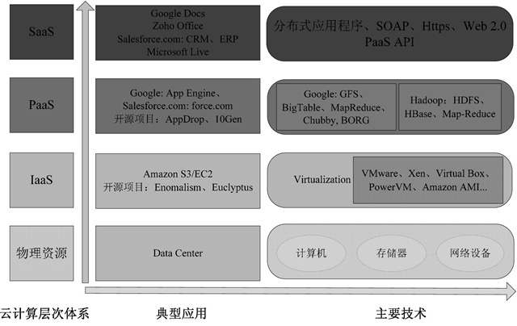
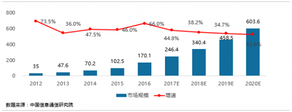
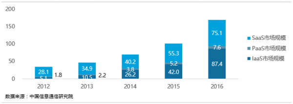
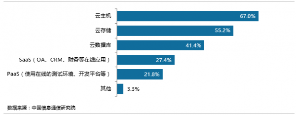
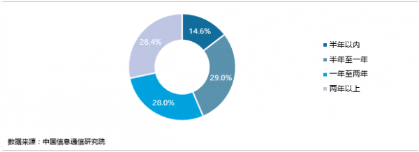
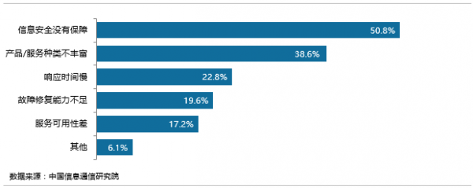

##  公有云服务平台的过去、现在和未来

### 一、认识公有云

####  （一）公有云
*	维基百科：**公有云**(public cloud) 是第三方提供一般公众或大型产业集体使用的云端基础设施，拥有它的组织出售云端服务，系统服务提供者借由租借方式提供客户有能力部署及使用云端服务。

*	百度百科：公有云通常指第三方提供商为用户提供的能够使用的云，公有云一般可通过Internet使用，可能是免费或成本低廉的，公有云的核心属性是共享资源服务。这种云有许多实例，可在当今整个开放的公有云网络中提供服务。

*	公有云，就是在互联网上向所有网民提供`云计算`服务，网民可以通过Internet直接使用云计算服务，公用云的服务提供者可是专业的云服务提供商，也可以是自发的民间组织。

*	与私有云不同，公有云可为企业节省购买、管理和维护本地硬件及应用程序基础结构的昂贵成本——公有云提供商将负责系统的所有管理和维护工作。相较于本地基础结构，公有云还可更快部署且附有一个几乎可无限缩放的平台。只要公司员工可访问Internet，他们就可在任何办公室或分支结构通过自选设备使用相同的应用程序。

####  （二）云计算

##### 定义

- 云计算是基于互联网的相关服务的增加、使用和支付模式，通常涉及通过互联网来提供动态易狂战且经常是`虚拟化`的资源。

- 云是网络、互联网的一种比喻说法。

- 现阶段广为接受的是美国国家标准技术研究院（NIST）定义：云计算是一种按使用量付费的模式，这种模式提供可用的、便捷的、按需的网络访问，进入可配置的计算资源共享池（资源包括网络，服务器，存储，应用软件，服务），这些资源能够被快速提供，只需投入很少的管理工作，或与服务供应商进行很少的交互。

##### 分类
- 按照服务的对象和范围，云可以分为：
  - 私有云：服务对象是单位（企业或机构）自己
  - 公有云：服务对象是社会上的客户
  - 混合云：既为单位自己使用，也对外开放资源服务


  |            | 公有云                          | 私有云              |  混合云           |
  | -----------|:-------------------------------:| :-----:|:-----:|
  | 适合行业    | 互联网原生行业（其他行业逐步迁移） | 秘密性较强行业 |所有类型行业|
  | 适合客户规模| 中小客户（大客户逐步迁移）         |  大/中型客户|所有类型用户（但小客户建议直接上公有云）|
  | 特点       | 弹性强，无须硬件采购，运维好，是最彻底的云 |秘密性强，可进行深度开发，可利用既有闲置硬件 |兼有公有云和私有云有点，但架构复杂|

- 按照服务的模式，云又分为如下几类：
  - 基础设施即服务(IaaS)：提供虚拟机或者其他资源作为服务提供给用户
  - 平台即服务(PaaS)：将一个开发平台作为服务提供给用户
  - 软件即服务(SaaS)：将应用作为服务提供给用户

  其实云计算分几层的，分别是Infrastructure（基础设施）-as-a-Service，Platform（平台）-as-a-Service，Software（软件）-as-a-Service。基础设施在最下端，平台在中间，软件在顶端。别的一些“软”的层可以在这些层上面添加。

  **IaaS: Infrastructure-as-a-Service（基础设施即服务）**
    - 第一层叫做IaaS，有时候也叫做Hardware-as-a-Service，几年前如果你想在办公室或者公司的网站上运行一些企业应用，你需要去买服务器，或者别的高昂的硬件来控制本地应用，让你的业务运行起来。
    - 但是现在有IaaS，你可以将硬件外包到别的地方去。IaaS公司会提供场外服务器，存储和网络硬件，你可以租用。节省了维护成本和办公场地，公司可以在任何时候利用这些硬件来运行其应用。
    - 一些大的IaaS公司包括Amazon, Microsoft, VMWare, Rackspace和Red Hat.不过这些公司又都有自己的专长，比如Amazon和微软给你提供的不只是IaaS，他们还会将其计算能力出租给你来host你的网站。

  **PaaS: Platform-as-a-Service（平台即服务）**
    - 第二层就是所谓的PaaS，某些时候也叫做中间件。你公司所有的开发都可以在这一层进行，节省了时间和资源。
    - PaaS公司在网上提供各种开发和分发应用的解决方案，比如虚拟服务器和操作系统。这节省了你在硬件上的费用，也让分散的工作室之间的合作变得更加容易。网页应用管理，应用设计，应用虚拟主机，存储，安全以及应用开发协作工具等。
    - 一些大的PaaS提供者有Google App Engine,Microsoft Azure，Force.com,Heroku，Engine Yard。最近兴起的公司有AppFog, Mendix 和 Standing Cloud。

  **SaaS: Software-as-a-Service（软件即服务）**
    - 第三层也就是所谓SaaS。这一层是和你的生活每天接触的一层，大多是通过网页浏览器来接入。任何一个远程服务器上的应用都可以通过网络来运行，就是SaaS了。
    - 你消费的服务完全是从网页如Netflix, MOG, Google Apps, Box.net, Dropbox或者苹果的iCloud那里进入这些分类。尽管这些网页服务是用作商务和娱乐或者两者都有，但这也算是云技术的一部分。
    - 一些用作商务的SaaS应用包括Citrix的GoToMeeting，Cisco的WebEx，Salesforce的CRM，ADP，Workday和SuccessFactors。

  **云计算层次体系**
  >图源来自互联网

  

>想要通俗易懂的云计算的解释？请点->>[如何理解云计算？很简单，就像吃货想吃披萨了...](http://www.chinacloud.cn/show.aspx?id=19758&cid=18)


##### 发展

```
1959 年6 月，ChristopherStrachey 发表虚拟化论文，虚拟化是今天云计算基础架构的基石。
1961 年，JohnMcCarthy 提出计算力和通过公用事业销售计算机应用的思想。
1962 年，J.C.R.Licklider 提出“星际计算机网络”设想。
1965 年美国电话公司WesternUnion 一位高管提出建立信息公用事业的设想。
1984 年，Sun 公司的联合创始人JohnGage 说出了“网络就是计算机”的名言，用于描述分布式计算技术带来的新世界，今天的云计算正在将这一理念变成现实。
1996 年，网格计算Globus 开源网格平台起步。
1997 年，南加州大学教授RamnathK.Chellappa 提出云计算的第一个学术定义“，认为计算的边界可以不是技术局限，而是经济合理性。
1998 年，VMware（威睿公司）成立并首次引入X86 的虚拟技术。
1999 年，MarcAndreessen 创建LoudCloud，是第一个商业化的IaaS 平台。
1999 年，salesforce.com 公司成立，宣布”软件终结“革命开始。  2000 年，SaaS 兴起。
2004 年，Web2.0 会议举行，Web2.0 成为技术流行词，互联网发展进入新阶段。
2004 年，Google 发布MapReduce 论文。Hadoop 就是Google 集群系统的一个开源项目总称，主要由HDFS、MapReduce 和Hbase 组成，其中HDFS是GoogleFileSystem（GFS）的开源实现；MapReduce 是GoogleMapReduce 的开源实现；HBase 是GoogleBigTable 的开源实现。
2004 年，DougCutting 和MikeCafarella 实现了Hadoop 分布式文件系统（HDFS）和Map-Reduce，Hadoop 并成为了非常优秀的分布式系统基础架构。
2005 年，Amazon 宣布AmazonWebServices 云计算平台。
2006 年，Amazon 相继推出在线存储服务S3 和弹性计算云EC2 等云服务。
2006 年，Sun 推出基于云计算理论的”BlackBox“计划。
2007 年，Google 与IBM 在大学开设云计算课程。
2007 年3 月，戴尔成立数据中心解决方案部门，先后为全球5 大云计算平台中的三个（包括WindowsAzure、Facebook 和Ask.com）提供云基础架构。
2007 年7 月，亚马逊公司推出了简单队列服务（SimpleQueueService，SQS），这项服务使托管主机可以存储计算机之间发送的消息。
2007 年11 月，IBM 首次发布云计算商业解决方案，推出”蓝云“（BlueCloud）计划。
2008 年1 月，Salesforce.com 推出了随需应变平台DevForce,Force.com 平台是世界上第一个平台即服务的应用。
2008 年2 月，EMC 中国研发集团云架构和服务部正式成立，该部门结合云基础架构部、Mozy 和Pi 两家公司共同形成EMC 云战略体系。
2008 年2 月，IBM 宣布在中国无锡太湖新城科教产业园为中国的软件公司建立第一个云计算中心。
2008 年4 月，GoogleAppEngine 发布。
2008 年中，Gartner 发布报告，认为云计算代表了计算的方向。
2008 年5 月，Sun 在2008JavaOne 开发者大会上宣布推出”Hydrazine“计划。
2008 年6 月，EMC 公司中国研发中心启动”道里“可信基础架构联合研究项目。
2008 年6 月，IBM 宣布成立IBM 大中华区云计算中心。
2008 年7 月，HP、Intel 和Yahoo 联合创建云计算试验台OpenCirrus。
2008 年8 月3 日，美国专利商标局（以下简称”SPTO“）网站信息显示，戴尔正在申请”云计算“（CloudComputing）商标，此举旨在加强对这一未来可能重塑技术架构的术语的控制权。戴尔在申请文件中称，云计算是”在数据中心和巨型规模的计算环境中，为他人提供计算机硬件定制制造“。
2008 年9 月Google 公司推出GoogleChrome 浏览器，将浏览器彻底融入云计算时代。
2008 年9 月，甲骨文和亚马逊AWS 合作，用户可在云中部署甲骨文软件、在云中备份甲骨文数据库。
2008 年9 月，思杰公布云计算战略，并发布新的思杰云中心（CitrixCloudCenter，C3）产品系列。
2008 年10 月，微软发布其公共云计算平台——WindowsAzurePlatform，由此拉开了微软的云计算大幕。
2008 年12 月，Gartner 披露十大数据中心突破性技术，虚拟化和云计算上榜。
2008 年，亚马逊、Google 和Flexiscale 的云服务相继发生宕机故障，引发业界对云计算安全的讨论。
2009 年，思科先后发布统一计算系统（UCS）、云计算服务平台，并与EMC、Vmware建立虚拟计算环境联盟。
2009 年1 月，阿里软件在江苏南京建立首个”电子商务云计算中心“。
2009 年4 月，VMware 推出业界首款云操作系统VMwarevSphere4。
2009 年7 月Google 宣布将推出ChromeOS 操作系统。
2009 年7 月，中国首个企业云计算平台诞生（中化企业云计算平台）。
2009 年9 月，VMware 启动vCloud 计划构建全新云服务。
2009 年11 月，中国移动云计算平台”大云“计划启动。
2010 年1 月，HP 和微软联合提供完整的云计算解决方案。
2010 年1 月，IBM 与松下达成迄今为止全球最大的云计算交易。
2010 年1 月，Microsoft 正式发布MicrosoftAzure 云平台服务。
2010 年4 月，英特尔在IDF 上提出互联计算，图谋用X86 架构统一嵌入式、物联网和云计算领域。
2010 年，微软宣布其90%员工将从事云计算及相关工作。
2010 年4 月，戴尔推出源于DCS 部门设计的PowerEdgeC 系列云计算服务器及相关服务。
```
### 二、公有云现状

目前，公有云被认为是云计算的主要形态，在国内外发展如火如荼。近几年，许多企业将胡完全混合的基础设施和关键系统全部转移到公有云，呈现出了大规模的“云迁移”。

公有云市场目前主要有六类玩家，分别是大型互联网公司、创业公司、传统设备厂商、传统IDC厂商、电信运营商以及国外厂商，根据IDC、Gartner数据，2016年公有云市场规模在150亿人民币左右。这些公司很少有只做底层资源服务，已经逐步将业务向上拓展，提供应用开发平台以及各类基础应用。

>据Gartner称，2017年全球公有云服务市场预计增长18%达到2468亿美元，高于2016年的2092亿美元。最高增幅将来自于云系统基础设施服务（基础设施即服务，IaaS），这部分预计在2017年增长36.8%达到346亿美元。云应用服务（软件即服务，SaaS）预计增长20.1%达到463亿美元

>Gartner研究总监Sid Nag表示："整个全球公有云市场将进入稳定阶段，增长在2017年达到峰值的18%，然后在接下来的今年逐渐平缓下来。虽然一些组织机构仍然在考虑云在他们整体IT战略中的位置，但是成本优化和推进转型之路的努力给IT外包采购者们带来了强有力的承诺及结果。Gartner预测到2020年，采用云的战略将应用超过半数的IT外包交易。"

在[Rightscale：2016年全球七大公有云服务排名 亚马逊AWS遥遥领先](http://www.199it.com/archives/438966.html)文中可知全球公有云平台行业的领先者是亚马逊的AWS（57%受访者目前使用AWS）和微软的Azure（20%受访者目前使用Azure）

在中国，公有云平台发展也很迅速，经过多年发展，国内公有云逐步成熟，目前国内较为成熟的公有云有阿里云、腾讯云、AWS-China和UCloud等。下面将会结合一些报告来展示国内公有云的发展现状。

一、中国公有云市场规模
- 2016年，中国公有云市场整体规模达到了170.1亿元，比2015年增长66.0%。


- 细分规模
  - IaaS市场高速增长。2016年，IaaS市场规模达到87.4亿元，相比2015年增长108.1%，预计2017年仍将保持较高的增速；
  - PaaS市场规模相对较小。2016年市场规模为7.6亿元，相比2015年增长46.2%；
  - SaaS市场稳定增长。2016年市场规模达到75.1亿元，相比2015年增长35.8%。



二、公有云应用现状
- 产品选择
  - 企业需求击中在云主机、云存储等IaaS基础资源，对PaaS、SaaS的应用相对还较少


  
- 使用时间
  - 已经应用公有云的企业中，30%的企业使用时间超过两年，40%以上的企业使用时间在一年以下。


  


### 三、公有云平台的常见问题及安全事件

####  （一）常见问题

##### 安全问题

* 防护问题：目前，提供云服务的厂商，往往在安全防护方面的没有直接的管控模块，对于可能发生的攻击，部分采取外包的形式交给第三方来提供基础保障，造成云端的防护功能并不完全可控。安全防护工作，并不是一个非此即彼的问题，而是一个利益与质量之间的权衡和度量问题。
* 数据问题：通常情况下，数据价值越大、敏感性越强、开放程度越高，对由于公有云的开放程度较高，企业完全迁移公有云的数据价值大，业务层面的数据敏感性强，所以企业客户对安全性和合规性的需求比较高。
* 透明问题：公有云服务商往往宣称自己的服务如何全面、技术如何先进、流程设计如何科学，但是表面上的言辞并不能解决客户心底的顾虑。由于商业方面的原因，服务商一般会回避自身的短板，如平台迁移、灾备方式、业务连续性等。公有云业务体系的不透明，成为市场进一步发育的障碍。
* 规则问题：在用户业务、文档、数据生成的过程中，由于行业目前还没有细化相关责任归属的法律文本，只是以出售固定信息产品的形式来确定权责，基于用户具体业务操作过程中的安全责任问题，没有过多阐述，给服务商提供了规避的机会。鉴于此，有人建议称，云提供商应为客户提供某种证书，以证明他们的云已经满足了安全保存数据的法律和规则要求。
* 标准问题：在公有云的各种产品中，并没有一个可以互联互通的一个标准化协议，厂商之间也只是与各自的合作伙伴进行内部开发。一旦出现需求变更、数据迁移、突发事件等状况，用户的业务衔接必将出现断层，引发连锁反应。

##### 运维风险

因为公共云的运维管理工作必须通过互联网完成，和传统IT环境运维有很大不同，总结起来风险主要来自以下四个方面：

* 运维流量被劫持；公共云场景下运维最大的变化就是运维通道不在内网，而是完全通过互联网直接访问公共云上的各种运维管理接口。很容易被嗅探或中间人劫持攻击，造成运维管理账号和凭证泄露。

* 运维管理接口暴露面增大：原来黑客需要入侵到内网才能暴力破解运维管理接口的密码，而现在公共云上的用户一般都是将SSH、RDP或其它应用系统的管理接口直接暴露在互联网。只能依靠认证这一道防线来保证安全，黑客仅需破解密码或绕过认证机制就能直接获取管理员权限。
* 账号及权限管理困难：多人共享系统账号密码，都使用超级管理员权限，存在账号信息泄露和越权操作风险。
* 操作记录缺失：公共云中的资源可以通过管理控制台、API、操作系统、应用系统多个层面进行操作。如果没有操作记录，一旦出现被入侵或内部越权滥用的情况将无法追查损失和定位入侵者。

这些风险都是公共云场景下进行运维工作的常见风险。
####  （二）安全事件

##### 2015年

######  国外


* 事件1：俄罗斯约会网站泄露 2000 万用户数据 (2015.1)

  2015 年 1 月 26 日，网络安全软件开发商 Easy Solutions CTO 丹尼尔·英格瓦尔德森(Daniel·Ingevaldson)表示，俄罗斯约会网站 Topface 有 2000 万访客的用户名和电子邮件地址被盗。

* 事件2：美国第二大医疗保险公司遭黑客攻击 8000 万用户资料受影响 (2015.2)

  2015 年 2 月 6 日，美国第二大医疗保险公司 Anthem 表示被黑客入侵，共计 8000 万个人信息遭到泄露，包括当前和以前的保险客户和员工信息。

* 事件3：Uber公司最大数据事故 5万名优步司机信息遭泄露 (2015.2)

  2015 年 2 月 28 日，大约5万名优步(Uber)司机的个人信息被不知名的第三方人士获取，成为该公司遭遇的最大规模的数据泄露事件。

* 事件4：美医疗保险公司CareFirst被黑 110万用户信息泄露 (2015.3)

  2015 年 3 月，美国大型医疗保险商CareFirst表示，该公司去年六月发现有黑客入侵，约有110万医疗保险客户的个人信息遭泄露。BlueCross BlueShield(BCBS)是一个联邦医疗保险服务商，服务美国近三分之一的人口。CareFirst BCBS是其在大西洋中部的子公司，在哥伦比亚特区、马里兰州和维吉尼亚州为客户提供健康保险。

* 事件5：HackingTeam被黑 “互联网军火”泄露 (2015.7)
  2015 年 7 月初，有 “互联网军火库” 之称的意大利监控软件厂商 Hacking Team 被黑客攻击，400GB 内部数据泄露。

* 事件6：婚外情网站 Ashley Madison 被黑 3700 万用户数据泄露 (2015.7)
  2015 年 7 月，著名婚外情网站 AshleyMadison.com 遭到黑客攻击，3700 万用户数据和公司信息被黑客悉数放到网络中，造成广泛影响。

* 事件7：美国人事管理局遭遇大规模网络攻击 (2015.7)

  2015 年 7 月，美国联邦人事管理局（OPM）公开承认曾遭到两次黑客入侵攻击，攻击造成现任和退休联邦雇员超过 2210 万相关个人信息和 560 万指纹数据遭到泄露。

  泄露内容包括详细个人信息，如社会安全码、姓名、出生年月、居住地址、教育工作经历、家庭成员和个人财务信息等。美官员声称，这是美国政府历史上最大的数据泄露案件之一。

* 事件8：英国史上最惨数据泄露 400万人信息泄漏 (2015.9)

  2015 年 9 月，英国宽带服务提供商TalkTalk表示，该公司网站日前所遭受的网络攻击可能导致其400多万客户的个人数据被盗，这可能是英国史上最大规模的数据泄漏事件之一。该公司表示很客户的姓名、地址、生日、电话号码、电邮地址、账户详细情况、信用卡详细情况等数据很有可能都被窃取了。本次攻击可能是英国企业迄今为止遭受的最大规模和最具破坏性的网络入侵事件。

######  国内

* 事件1：国内某著名手机论坛 2300 万用户信息泄露 (2015.1)

  2015 年 1 月 5 日,国内某著名手机论坛被曝出存在高危漏洞,多达 2300 万用户信息遭遇安全威胁。

* 事件2：超30省份社保系统被曝漏洞 个人社保隐私存重大风险 (2015.4)

  2015 年 4 月 22 日，超 30 个省市卫生和社保系统出现大量高危漏洞，仅社保类信息安全漏洞涉及数据就达到 5279.4 万条，包括身份证、社保参保信息、财务、薪酬、房屋等敏感信息。

* 事件3：大麦网600多万用户账号密码泄露 数据已被售卖 (2015.8)

  2015 年 8 月 27 日，乌云漏洞报告平台发布报告显示，线上票务营销平台大麦网再次被发现存在安全漏洞，600 余万用户账户密码遭到泄露。

* 事件4：阿里云服务器安全程序升级触发bug 致用户文件及命令误删除 (2015.9)

  2015 年 9 月 1 日阿里云服务器预装的安全产品云盾“安骑士”升级触发bug，将所有新启动的可执行文件都当成了恶意文件进行隔离，部分用户的线上服务受到严重影响，并无法进行运维工作。

* 事件5：网易邮箱过亿数据疑似泄露 危及支付宝Apple ID游戏账号安全 (2015.10)

  2015 年 10 月 19 日，乌云漏洞报告平台接到一起惊人的数据泄密报告后发布新漏洞，漏洞显示网易邮箱用户数据库疑似泄露，影响到过亿数据，泄露信息包括用户名、密码、密码密保信息、登录 IP以及用户生日等。使用该邮箱注册的相关账户均受到牵连。


##### 2016年
* 事件1：Centene数据泄露 95万成员可能受影响 (2016.1)

  2016 年 1 月，多条生产线的保健企业 Centene 宣布，95 万成员可能受到数据破坏的影响。该数据泄露是由丢失的六个硬盘引起的，导致其在 2009 年到 2015 年间该实验室服务的成员的个人健康信息泄露。该公司表示，信息包括姓名、地址、出生日期，社会安全号码、身份证号码等其他健康信息。

* 事件2：美国联邦调查局、国土安全部遭黑客攻击 (2016.2)

  2016 年 2 月，黑客最终攻击兵威胁了联邦调查局和国土安全部将近3万名员工的数据记录。这些记录包括大约9万名国土安全部的员工和2万名联邦调查局的员工，包括姓名、职务和联系方式等个人信息。黑客首先向 Motherboard 发出了这些文件，并声称其访问了更多的文件，总计有 200GB 容量。

* 事件3：21st Century Oncology 遭受数据泄露 (2016.3)
  2016 年 3 月，位于佛罗里达州迈尔斯堡的癌症护理公司21st Century Oncology，宣布其遭受了数据泄漏，导致其位于50个州和全球的220万个患者的信息被泄露。该公司表示，黑客在十月份攻击了数据库，访问了患者的个人信息，包括姓名、社会保险号、医生姓名、诊断、治疗数据和保险信息。

* 事件4：薪酬巨头ADP遭遇信息泄露事件 (2016.5)

  2016 年 5 月，薪酬巨头 ADP 经历了一场大的信息泄露事件，导致其所服务的接近 64 万个企业的薪酬、税务及福利信息泄露。这场破坏是因为 ADP 的客户门户网站的一个漏洞所导致的，该公司表示，这给黑客访问 W-2 信息的机会。 ADP 表示，黑客似乎从以前的攻击中获得了数据，在访问系统之前，已经访问了用户的个人数据。这起破坏是今年税收季发生的系列的 W-2 信息侵袭的一部分。

* 事件5：雅虎先后证实共超15亿用户信息遭窃 (2016.9 & 2016.12)

  2016年陷入收购漩涡的雅虎，先后在9月份证实至少5亿用户信息在2014年被窃，涉及用户姓名、电子邮箱、电话号码、出生日期和部分登录密码。随后12月份再次证实2013年有超过10亿条账户信息、账户密码和个人信息一并在泄露之列，而且与2014年遭窃的数据不同。


### 四、公有云平台的未来

市场究竟需要什么样的“云”？公有云会成为未来的主流吗？
>根据Gartner的报告，2016年全球企业IT费用支出为3.5万亿美金，公有云市场规模占整个IT费用支出的5%左右——这个在云计算产业中占据统治地位的数字已经说明，公有云将是未来市场最不可忽视的热点。而从国内外公有云市场份额占整个IT行业市场规模比例的差距来看，未来中国公有云市场潜力巨大。

##### 一、公有云和私有云的差异

1.构建主体不一样

  公有云主要是由实力较大的厂家面向市场提供公共的存储、计算节点服务。私有云主要是第三方为企业搭建云平台

2.客户群不一样

  公有云面向市场提供公共服务，私有云面向企业提供定制服务。

3.使用成本不一样

  一般个人或者中小企业购买设备搭建云平台代价过于昂贵，设备技术运维都达不到，但是购买公有云就解决了问题，只需要将服务部署到云平台就行。私有云则需要企业购买大量X86服务器，还需要有搭建云平台的技术力量以及相应的运维人员，成本比较高。

  此外，随着业务量的增大，公有云成本也随之增高；私有云初则相反，前期成本高，随着业务量增加，后期成本低。

4.价格不一样

  公有云价格比私有云价格贵。最典型的案例就是亚马逊公有云利润已经超过零售利润。

5.安全性

  公有云数据在第三方，存在被泄露的风险。数据安全完全取决于第三方的技术能力和专业性

  私有云数据的所有权为企业自身，企业乣从流程上控制，以防数据被泄露。企业自主保证数据的安全性，如果企业投入资源不足，可能存在数据被窃取或者数据丢失的可能性。

6.可控性

  公有云为第三方提供的标准解决方案或个性化方案，企业不能任意的修改需求。

  私有云是为了企业单独使用而够贱的，可以定制或者从0开发。

7.服务质量

  公有云取决于第三方服务提供商，可能会受到网络不稳定的影响

  私有云企业自主保证服务质量，可以通过加强监控，保证服务的稳定性。

##### 二、公有云的优势

  1.公有云基于互联网的发展，加速实现互联互通。互联网从最初的互联互通，发展到现在，成为人类社会的各种社会活动（经济活动、生活、社交活动）的平台。但互联网的发展远没有停止，公有云的出现，使得围绕着互联网的各种服务，加速地向社会生活的纵深挺进。

  2.公有云部署在公有的云端上，拓展能力和协同能力较强，节省了企业的数据中心维护工作时间，帮助企业将更多的工作和业务全部进行云迁移，实现不同部门和工作的协同，灵活性凸显。

  3.公有云是提供给公众公有计算资源的服务，实现了资源共享。公有云基于目前已经成熟的且得到广泛应用的互联网提供给公众服务，必须保证任何人，在任何地点，通过各种接受服务的计算媒介（如PC机、移动手机、各种平板电脑、汽车电子等）都可以获得，资源可实时共享。

  4.公有云投入成本更低，实现零边际成本。私有云需要有基础IT设施和完善的IT团队，企业为此付出的部署、维护成本偏高，而公有云则仅需由服务商统一维护更新，企业不必分担过多的成本，采购价格低廉。

  5.公有云有助于提升商业价值与创新。公有云能将IT部门的精力和注意力集中于更值得关注的方面，提高整体商业价值，在数据挖掘领域追求创新，分析和为用户提供更专业的服务，这样的企业才能变得更有效率。

##### 三、公有云的劣势

  

  1.信息安全得不到保障

  当公司放弃他们的基础设备并将其数据和信息存储于云端时，很难保证这些数据和信息会得到足够的保护。而且，公有云庞大的规模和涵盖用户公司的多样性也让其成为了黑客们喜欢攻击的目标。一些公司也比较担心公有云硬件共享的问题。通过公有云，不同公司之间的工作都将在同一服务器上进行，也就是说一家公司很有可能与其竞争者使用同样一个服务器，这种共享模式很可能鬼将他们的机密数据和信息泄漏给竞争者

  2.不可预测成本

  按使用付费的模式其实是把双刃剑，一方面它确实降低了公有云的使用成本，但另一方面它也会带来一些难以预料的花费。比如在使用某些特定应用程序时，公司会发现支出会相当惊人。

##### 四、前景瞻望

混合云目前多数仍然是以私有云为主体，向公有云进行延伸，本质上仍然是私有云，客户还是需要为IT基础设施支付大量费用，这与云计算的本义实际上是背道而驰，云的优势并没有被完全发挥出来。公有云虽然目前主要的顾虑是稳定性和安全性，但是未来随着时间推移及技术发展，公有云的安全性、稳定性与价格优势会愈发明显，所以绝大多数人认为云计算的最终形态是公有云。

### 参考资料
> [ "维基百科_公有云"](https://d1.zgdhhjha.com/zh-hans/%E5%85%AC%E7%94%A8%E9%9B%B2)

> ["百度百科_公有云"](https://baike.baidu.com/item/%E5%85%AC%E6%9C%89%E4%BA%91)

> [Microsoft Azure_什么是公有云](https://azure.microsoft.com/zh-cn/overview/what-is-a-public-cloud/?cdn=disable)

>[2015年中国公有云服务发展报告——其他讨论](http://www.infoq.com/cn/articles/Publiccloud2015China-part7)

>[云计算是什么？](http://www.chinacloud.cn/show.aspx?id=15917&cid=17)

>[公有云服务安全问题五方面](http://www.idcloud.com.cn/active/s20140626974.html)

>[公有云运维安全常见四大难题及解决方案](https://www.csdn.net/article/2016-02-17/2826599)

>[权威报告告诉你 中国公有云发展如何！](http://cloud.idcquan.com/yzx/122229.shtml)

>[云计算系列之一：公有云是终极形态，未来将出现5-7家巨头厂商](http://36kr.com/p/5079494.html)
