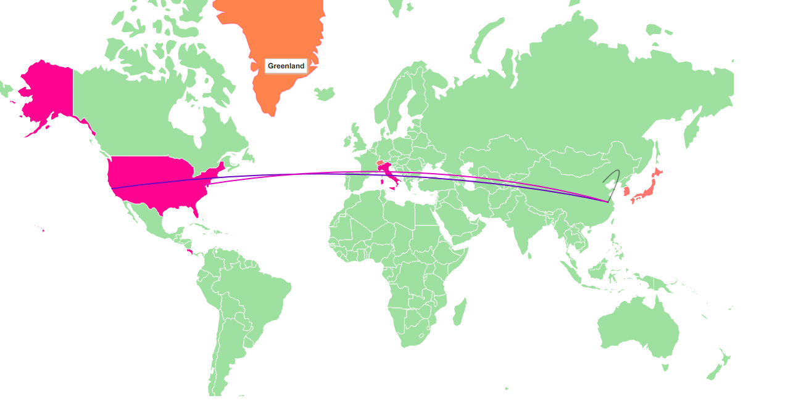

# 大作业进展及待补充之处

* 实现了前端输入一个域名，后端进行dns解析（dig +trace命令），然后在网页上显示的初步效果。
  * dns-resolve.py：通过dig +trace命令，先获得一个dns解析过程的ip列表，再根据列表中每一个ip查询其经纬度，以json串的形式返回给调用处。
  * returnvalue.php：调用dns-resolve.py，获得经纬度的json串。
  * procedure.php：调用returnvalue.php，用得到的经纬度信息绘图。
  * 绘图效果
    * 
* 问题及解决方案
  * dig +trace命令不稳定，只能通过指定dns解析服务器才能够成功执行。目前使用的是114.114.114.114
  * 目前的显示效果较差，不能体现动态过程，对于每一个点的具体地址没有显示，地图的颜色也较为单一
    * 目前使用绘图api是datamaps，准备更换为amcharts的api，主要有以下几个原因
      * 可以实现连线的动态显示
      * 可以实现节点bubble动态显示
      * 并且对于地图底图也相对更加好看
  * 如何证明智利用户访问facebook.com的域名解析，可能经过中国
    * 是通过本机伪造ip来实现吗