# 从SQL注入到Shell #
##	实验环境
下载镜像并转入虚拟机，使用```ifconfig```查看信息
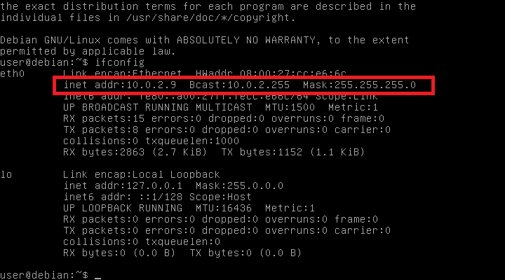

攻击者浏览器设置代理
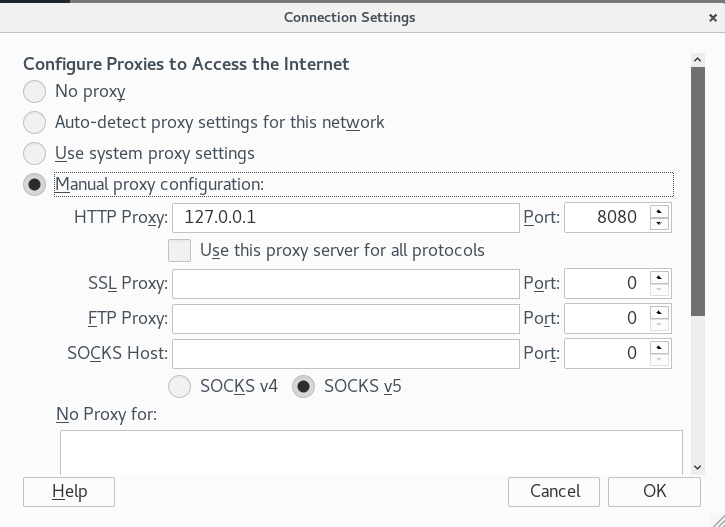

##  实验过程
### 收集信息
打开burpsuite，使用浏览器访问服务器，查看burpsuite捕获的数据可以收集服务器相关的信息，如PHP版本信息等。
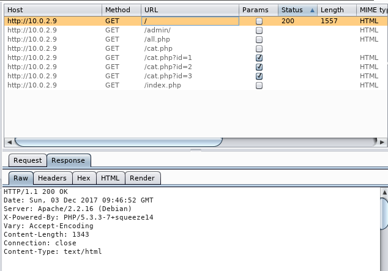

### 检测并利用SQL注入
####  基于整数的检测
通过http://10.0.2.9/cat.php?id=1 与 http://10.0.2.9/cat.php?id=2-1 返回的页面相同，说明数据库直接进行了减法，而没有对这种输入过滤， 因此存在SQL注入的可能性

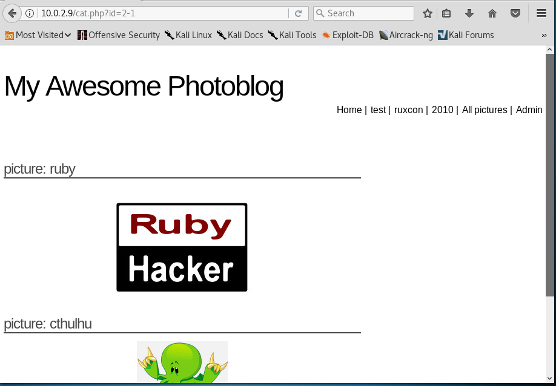

####  利用UNION开发SQL注入
* UNION前后的select语句返回列数必须相同，可以递增查询列数从而检测出数据库该查询语句会查询多少列
  * 当猜测列数为2，返回报错信息，表示猜测列数不正确
  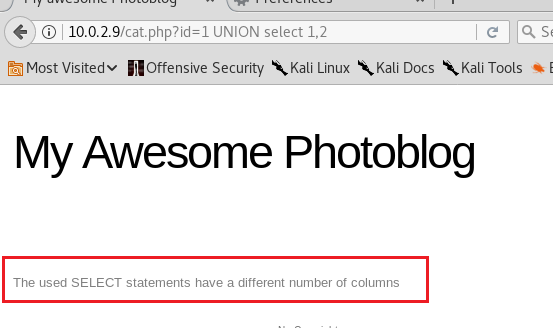

  * 当猜测列数为4，无报错，表示猜测列数正确
  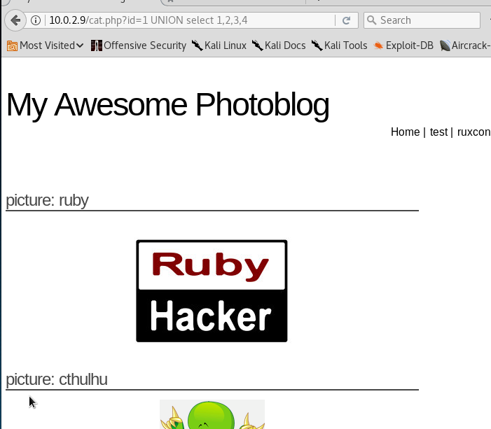

* 也可以使用```order by```来检测查询列的数目
  * 当排序数目大于列数时会返回报错信息
  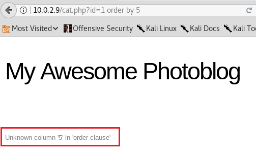

#### 通过SQL注入得到信息
结合已经得到的查询列数信息，可以通过@@version，current_user()和database()获得数据库版本信息、当前用户信息以及数据库名
* 获得数据库版本信息
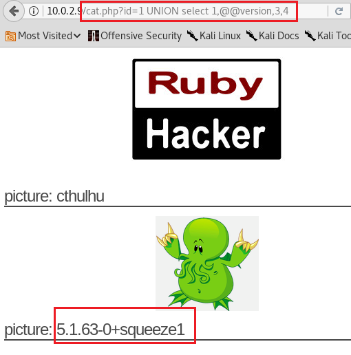

* 获得当前用户信息
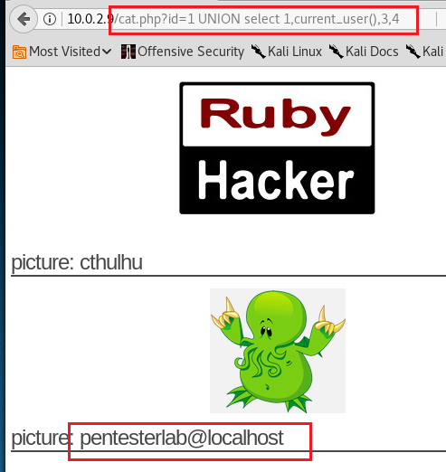

* 获得当前数据库名
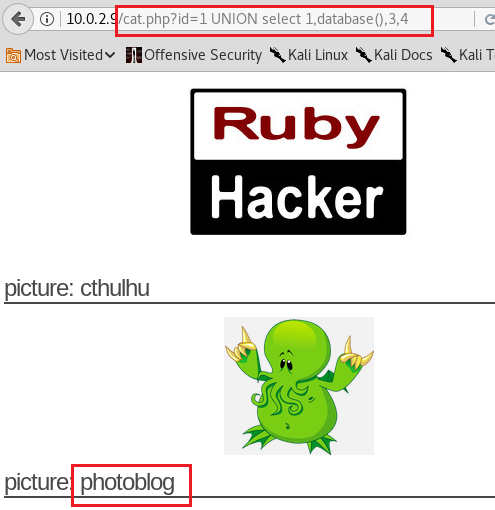

还可以获得所有表名、列名以及表和列间的对应关系
* 例表和列之间的对应关系
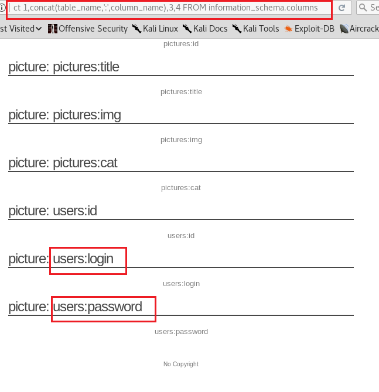

发现users表中的login和password字段，将它们查询出来
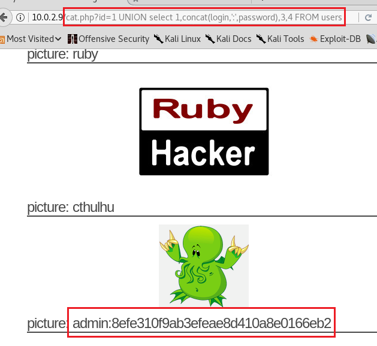

####  进入管理页面并执行代码
* 将得到的密码哈希值在线解密，得到密码为P4ssw0rd
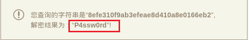

* 登录管理员账户
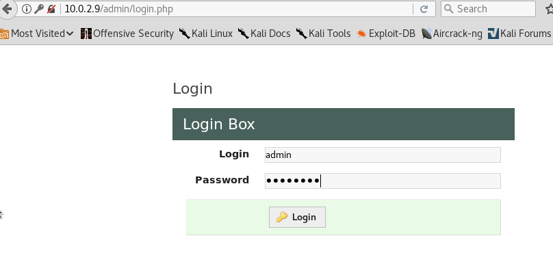

* 成功登录之后，点击跳转到上传文件页面
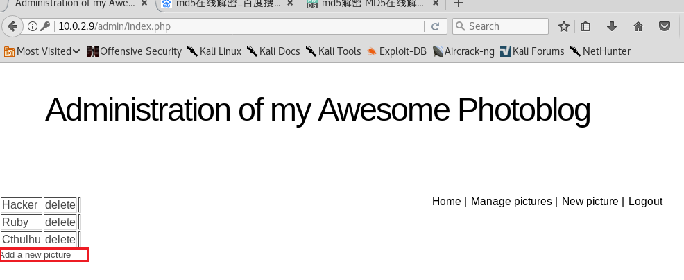

* 上传一个php脚本。把php脚本与网页服务器web目录下的正常文件放在相同路径下，可以在浏览器端实现命令执行环境，从而控制服务器

  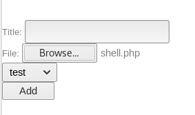

* 上传失败，原因为禁止上传php文件
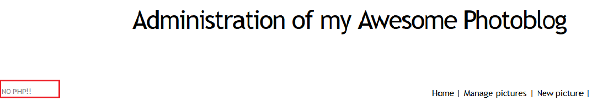

* 查找上传php文件的方法
  * .php3后缀可以绕过对.php后缀的过滤
  * .php.test也可以绕过.php过滤，Apache服务器会依然把它当做PHP文件

* 使用.php3为后缀上传
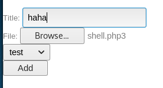

* 上传成功后点击文件进行查看
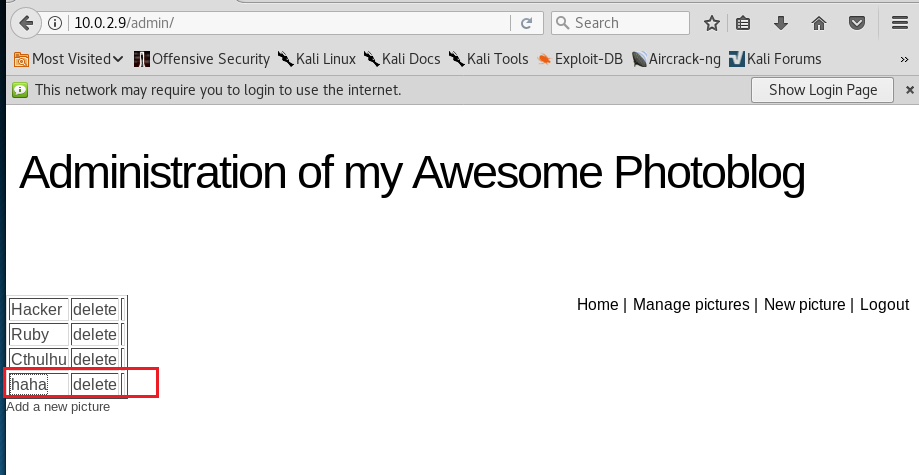

* 查看该页面源代码，可以看到php文件在服务器上的存储路径
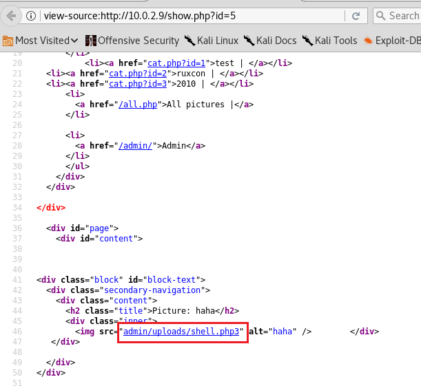

* 访问该路径并通过cmd参数，可以获取服务器的大量信息，并执行代码，如
  * 通过```ls```得到当前目录或上级目录信息
  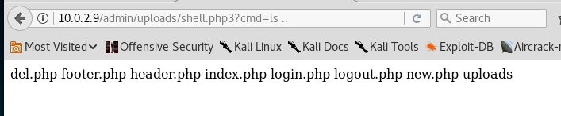

  * 通过```cat /etc/passwd```得到系统用户列表
  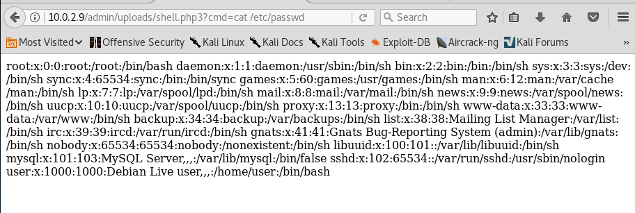

  * 通过```cat /etc/hosts```等指令可以查看主机信息，更改网络配置，甚至重启系统
  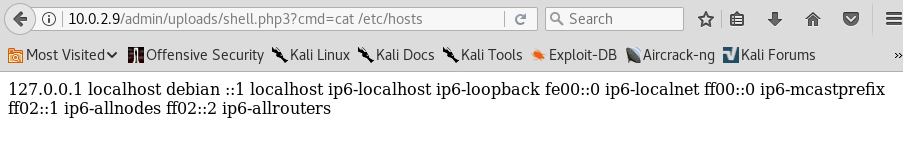
