# 实战Bro网络入侵取证
##  安装bro
`apt-get install bro bro-aux`

* 安装时遇到以下问题
  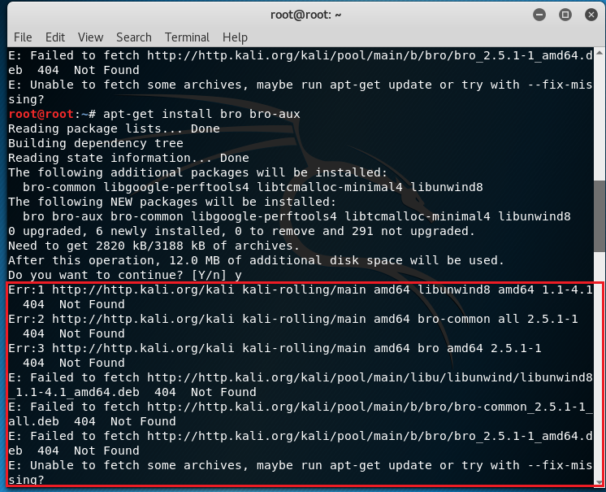

* 解决方法

  `apt-get update`

  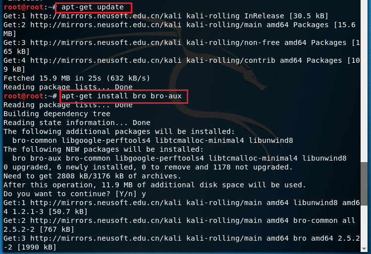

##  实验环境基本信息
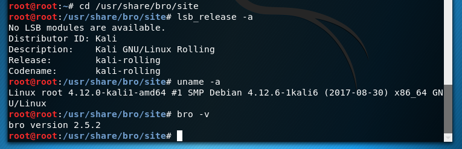

##  编辑bro配置文件
* 编辑`/etc/bro/site/local.bro`，在文件尾部追加两行新配置代码
      @load frameworks/files/extract-all-files
      @load mytuning.bro

  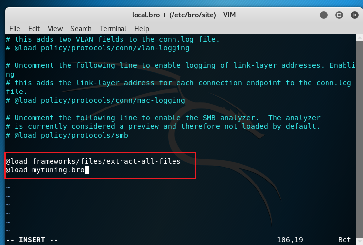

  加载库指令，以@load来加载module中定义的命名空间。命令1表示使用bro提取所有文件，命令2表示加载mytuning.bro中我们自己编写的指令。

* 在`/etc/bro/site/`目录下创建新文件mytuning.bro，内容为：
      redef ignore_checksums = T;
  

  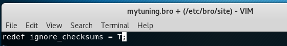

  使bro能够在系统上分析本地捕获流量，忽略校验和验证。

##  使用bro自动化分析pcap文件
* 下载实验所用pcap包：http://sec.cuc.edu.cn/huangwei/textbook/ns/chap0x12/attack-trace.pcap

* 使用bro分析流量包
      bro -r attack-trace.pcap /etc/bro/site/local.bro

  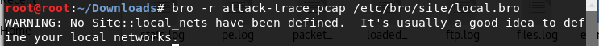

  * 出现警告信息`WARNING: No Site::local_nets have been defined. It's usually a good idea to define your local networks.`对于本次入侵取证实验来说没有影响。
  * 如果要解决上述警告信息，也很简单，同样是编辑mytuning.bro，增加一行变量定义即可(此本地网络地址ip范围为pcap包中靶机ip所在网络)
        redef Site::local_nets = { 192.150.11.0/24 };
    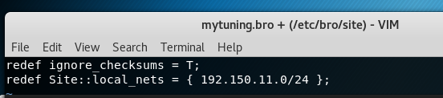

  * 注意添加和不添加上述一行变量定义除了bro运行过程中是否会产生警告信息的差异，增加这行关于本地网络IP地址范围的定义对于本次实验来说会新增2个日志文件，会报告在当前流量（数据包文件）中发现了本地网络IP和该IP关联的已知服务信息。

* 在attack-trace.pcap文件的当前目录下会生成一些`.log`文件和一个extract_files目录，在该目录下我们会发现有一个文件。
  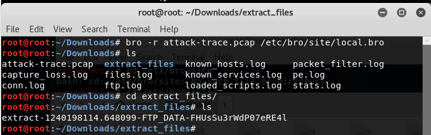

* 将该文件上传到virustotal我们会发现匹配了一个历史扫描报告，该报告表明这是一个已知的后门程序！
  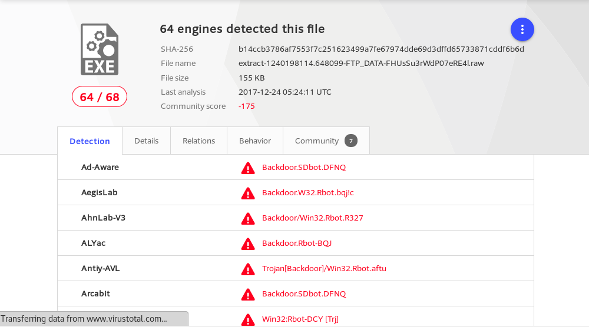

  至此，基于这个发现就可以进行逆向倒推，寻找入侵线索了。

* 通过阅读`/usr/share/bro/base/files/extract/main.bro`的源代码
  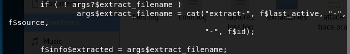
  我们了解到该文件名的最右一个-右侧对应的字符串`FHUsSu3rWdP07eRE4l`是`files.log`中的文件唯一标识。

* 通过查看`files.log`，发现该文件提取自网络会话标识（bro根据IP五元组计算出的一个会话唯一性散列值）为`CNONGR2bV5VRo9oyX1`的FTP会话。
  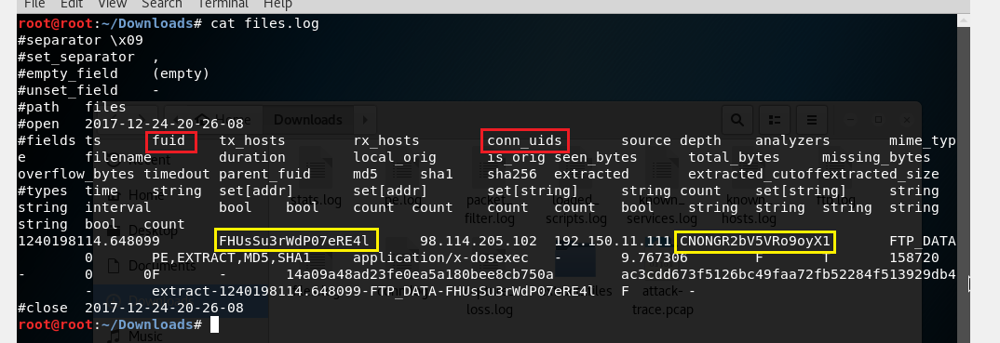

* 该`CNONGR2bV5VRo9oyX1`会话标识在`conn.log`中可以找到对应的IP五元组信息。
  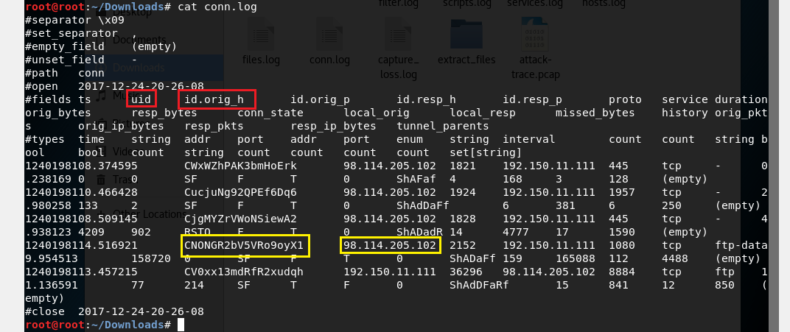
  通过`conn.log`的会话标识匹配，我们发现该PE文件来自于IPv4地址为：`98.114.205.102`的主机。
