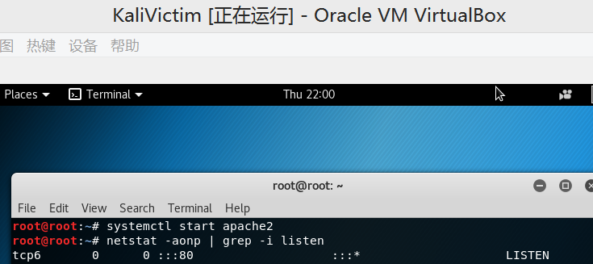
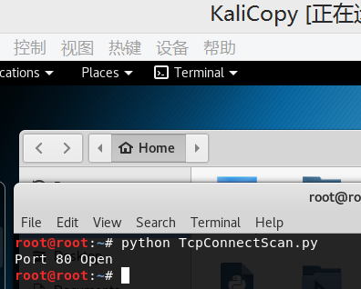
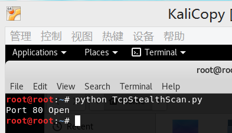
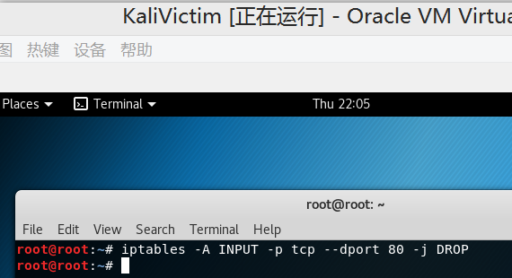
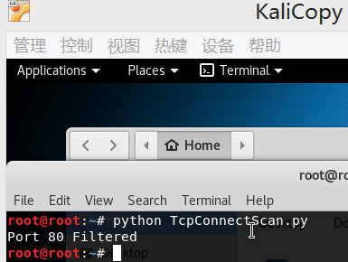
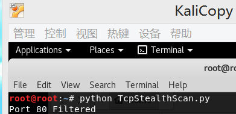
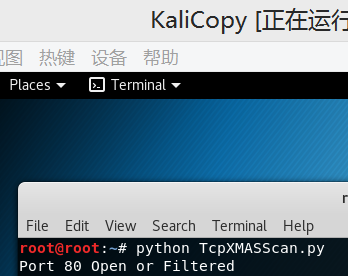

# 自己动手编程实现并讲解TCP connect scan/TCP stealth scan/TCP XMAS scan/UDP scan #

####	一  任务清单
-	[x]	TCP connect scan
-	[x]	TCP stealth scan
-	[x]	TCP XMAS scan
-	未实现 UDP scan

####	二	实验过程
*	开启80端口

*	TCP connect scan

*	TCP stealth scan

*	TCP XMAS scan

*	UDP scan
	*	未打开68端口，无法进行测试

*	对80端口开启过滤

*	TCP connect scan

*	TCP stealth scan

*	TCP XMAS scan

*	UDP scan
	*	未打开68端口，无法进行测试

####	三	实验代码

*	TCP connect scan
	*	[Code Click Here](code/TcpConnectScan.py)

*	TCP stealth scan
	*	[Code Click Here](code/TcpStealthScan.py)

*	TCP XMAS scan	
	*	[Code Click Here](code/TcpXMASScan.py)

*	UDP scan
	*	[Code Click Here](code/UdpScan.py)
