# 从SQL注入到Shell

### 环境配置
攻击者和靶机均设置为NAT网络，ip地址如图  

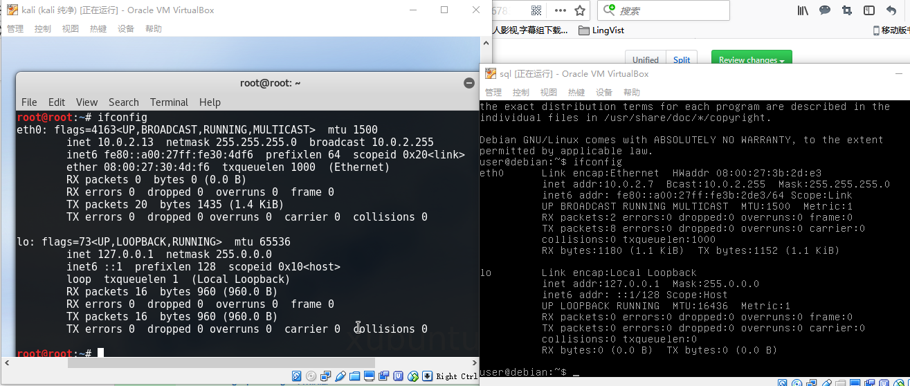

### 实验过程

#### 指纹识别

使用nmap查看开放端口  

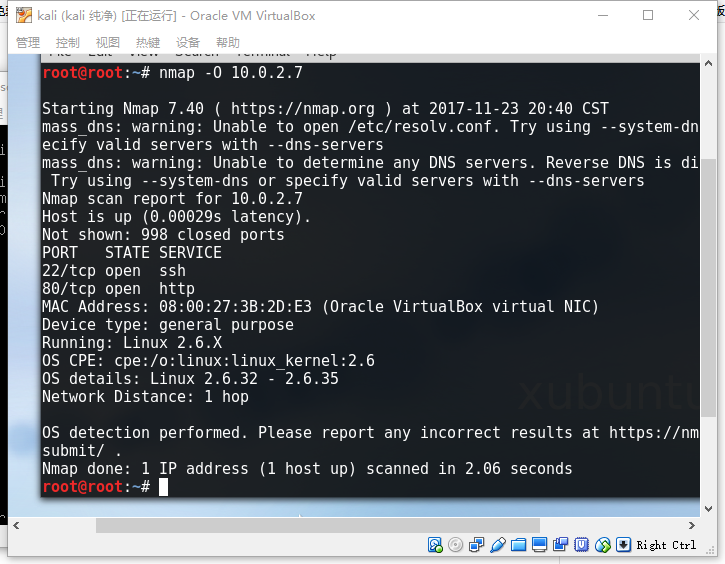

#### 检测、利用SQL漏洞

- 通过地址 http://10.0.2.7/cat.php?id=2-1 获取的页面与  http://10.0.2.7/cat.php?id=1  时获取页面相同，所以存在SQL注入漏洞。  

id=1  

  
id=2-1  
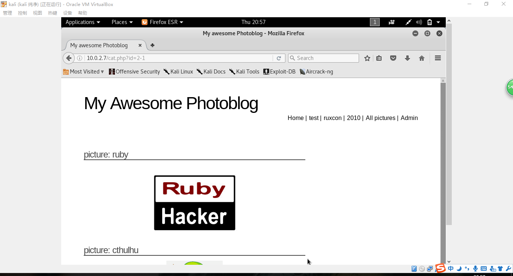

- 使用union查询获取列数为4。  

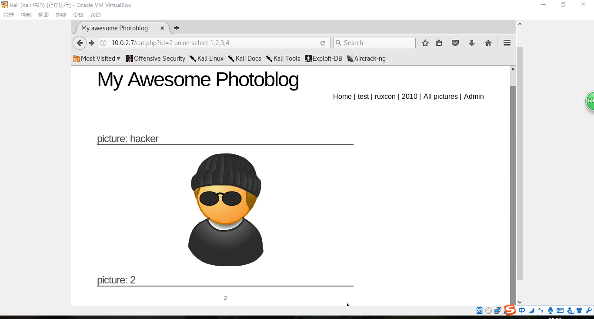

- 获取数据库版本信息。  

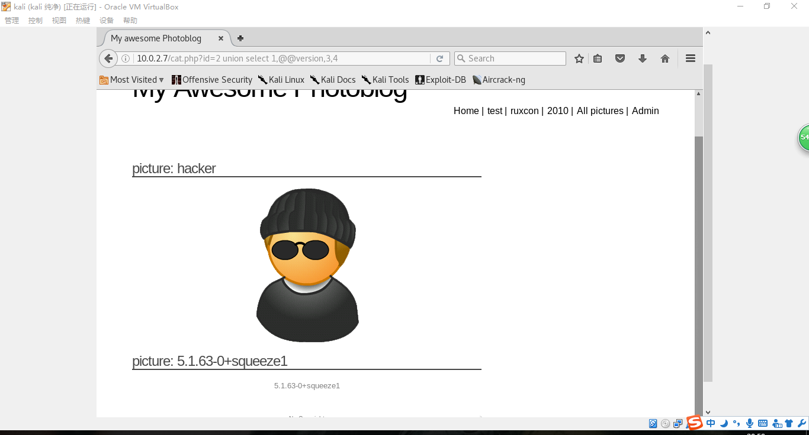

- 获取数据库表名和列名。  
 
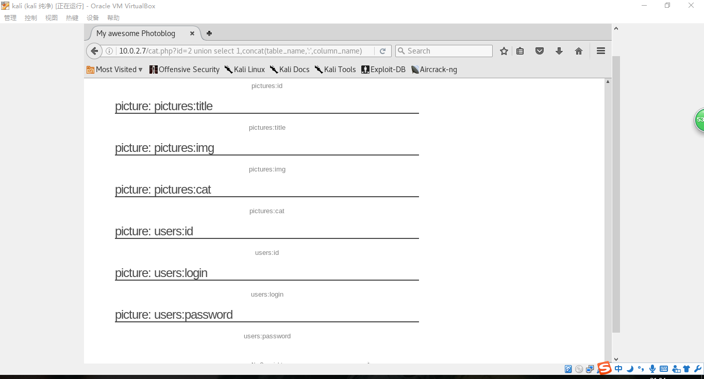

- 在用户名表中查询用户名和密码。  

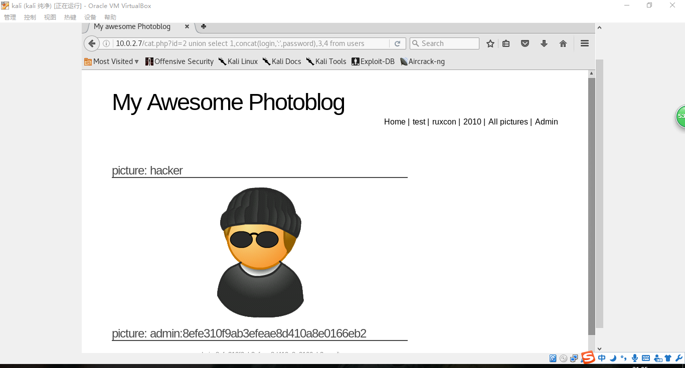

- 获取密码的MD5值。

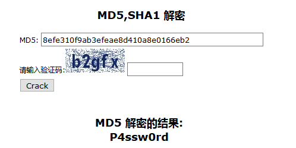

- 使用用户名密码成功登录  

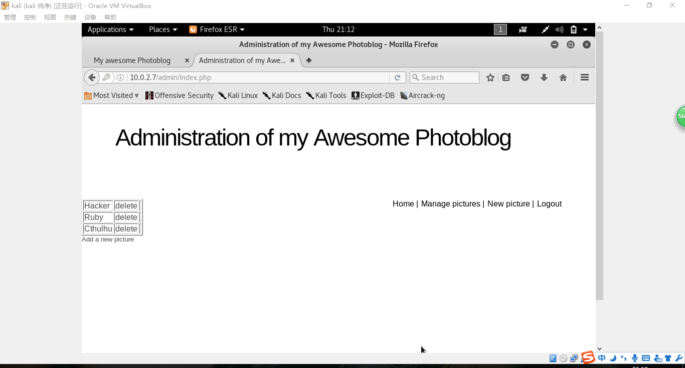

- 上传文件  

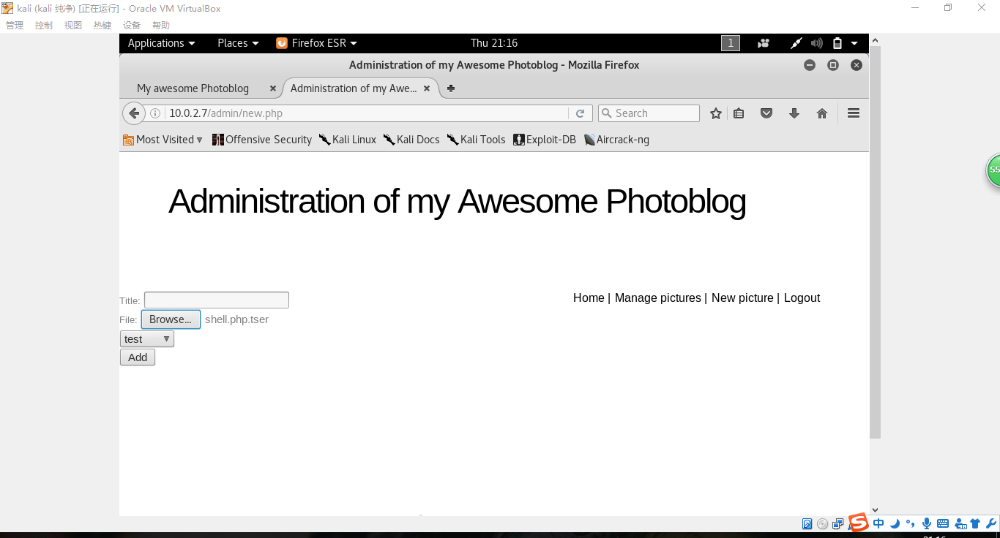  

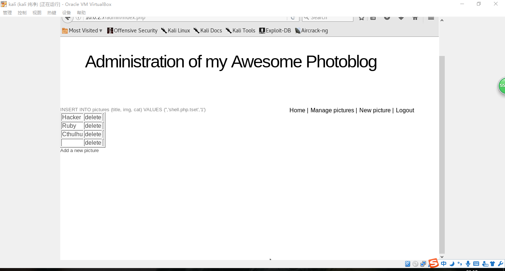
