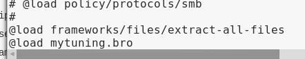
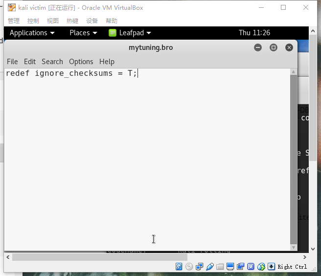
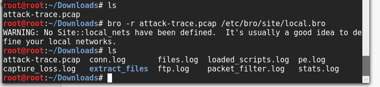
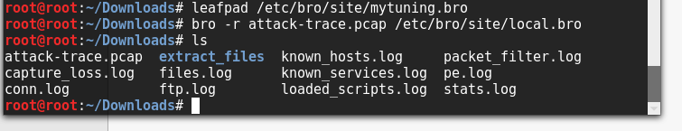
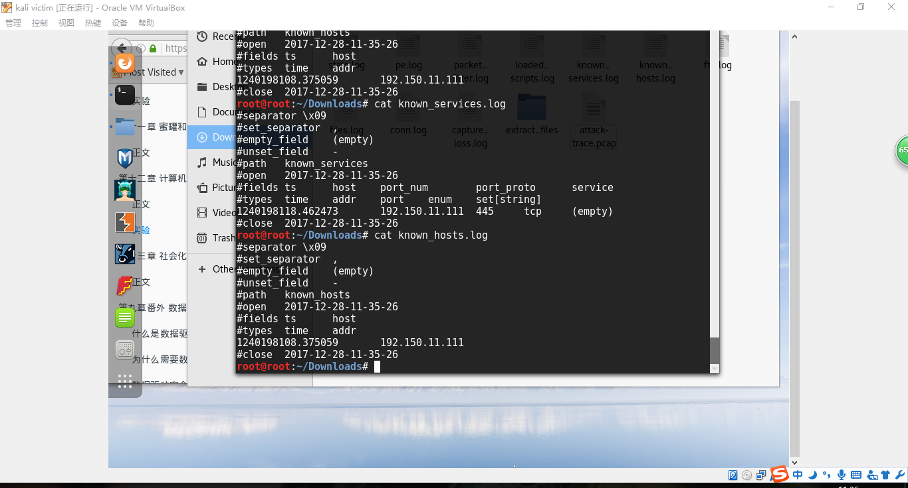
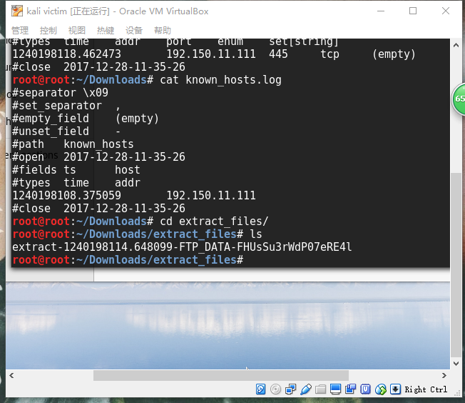
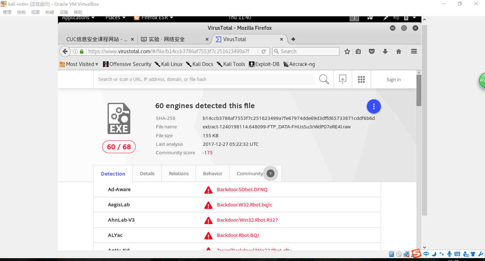
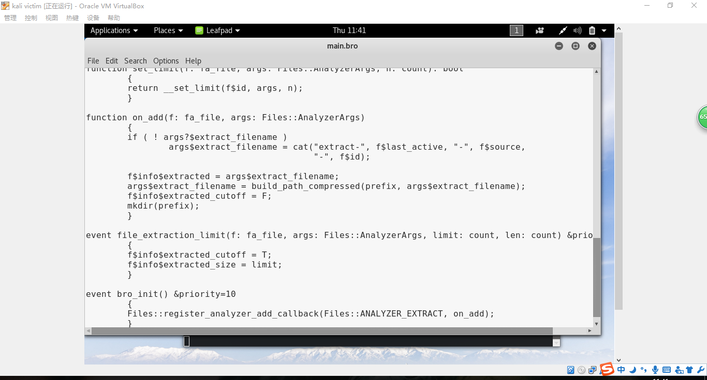
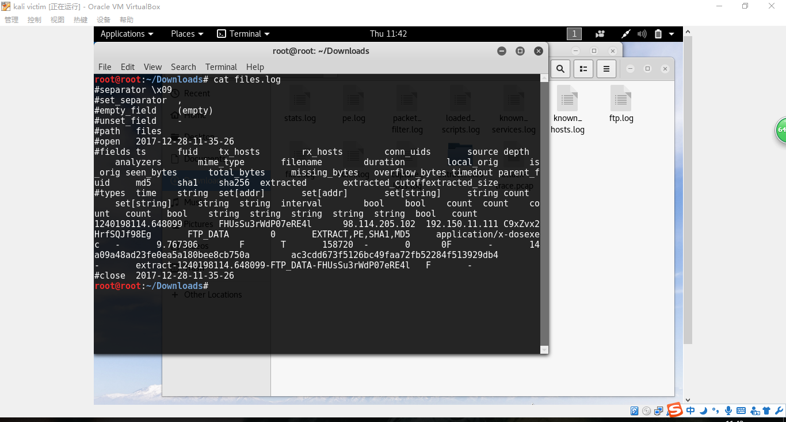
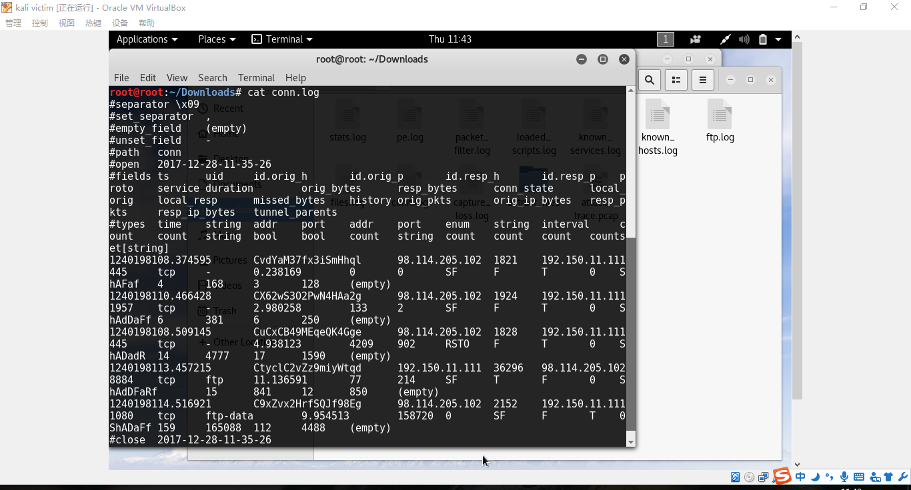

## 第四次试验报告·Bro网络入侵取证
### 实验过程
#### 安装bro
> apt-get install bro bro-aux

#### 实验环境基本信息


#### 编辑bro配置文件
- 编辑 /etc/bro/site/local.bro，在文件尾部追加两行新配置代码  

```
@load frameworks/files/extract-all-files
@load mytuning.bro
```





- 在/etc/bro/site/目录下创建新文件mytuning.bro，内容为：

> redef ignore_checksums = T;




#### 使用bro自动化分析pcap文件

```
 bro -r attack-trace.pcap /etc/bro/site/local.bro
```



  
出现警告信息 `WARNING: No Site::local_nets have been defined. It's usually a good idea to define your local networks. ` 对于本次入侵取证实验来说没有影响。

如果要解决上述警告信息，也很简单，同样是编辑 mytuning.bro，增加一行变量定义即可


```
redef Site::local_nets = { 192.150.11.0/24 };
```


注意添加和不添加上述一行变量定义除了bro运行过程中是否会产生警告信息的差异，增加这行关于本地网络IP地址范围的定义对于本次实验来说会新增2个日志文件，会报告在当前流量（数据包文件）中发现了本地网络IP和该IP关联的已知服务信息。

在attack-trace.pcap文件的当前目录下会生成一些.log文件和一个extract_files目录，在该目录下我们会发现有一个文件。




```
# file extract-1240198114.648099-FTP_DATA-FHUsSu3rWdP07eRE4l 
extract-1240198114.648099-FTP_DATA-FHUsSu3rWdP07eRE4l: PE32 executable (GUI) Intel 80386, for MS Windows
```



将该文件上传到virustotal我们会发现匹配了一个历史扫描报告，该报告表明这是一个已知的后门程序！




至此，基于这个发现就可以进行逆向倒推，寻找入侵线索了。

通过阅读 `/usr/share/bro/base/files/extract/main.bro` 的源代码



我们了解到该文件名的最右一个-右侧对应的字符串`FHUsSu3rWdP07eRE4l`是`files.log`中的文件唯一标识。

通过查看`files.log`，发现该文件提取自网络会话标识（bro根据IP五元组计算出的一个会话唯一性散列值）为`CP0WpmULcjBpkDTQf`的FTP会话。



该`CP0WpmULcjBpkDTQf`会话标识在`conn.log`中可以找到对应的IP五元组信息。

通过`conn.log`的会话标识匹配，我们发现该PE文件来自于IPv4地址为：`98.114.205.102`的主机。

