## 非图形验证码类验证方式的原理和安全性分析

### geetest(极验)验证
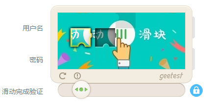

#### 原理
geetest（极验）验证方式属于无知识型验证方式，它最大的特点是不再基于知识进行人机判断，而是基于人类固有的生物特征以及操作的环境信息综合决策，来判断是人类还是机器。
#### 验证流程
  - 滑动按钮开始验证->风险分析->低风险校验通过，高风险二次验证

    首先用户滑动验证码到指定位置，完成后会给服务端回传各种加密信息，为了做风控规则来判断是否异常，其规则会包含用户IP，操作行为路径，UA,COOKIE，设备指纹等等，如果没有命中规则，就会放行校验通过，如果命中规则就会弹出二次校验，只有通过校验后才可以放行。

  - 解释：Web前端采集用户的操作数据，环境数据等等，非常多的数据，通过一个算法加密得到字符串，然后提交到服务器分析，服务器有一个判定标准，对数据进行简单的分析就知道是不是人工在操作。

#### 实现原理
根据人在滑动滑块的响应时间，拖拽速度，时间，位置，轨迹，重试次数等来评估风险。

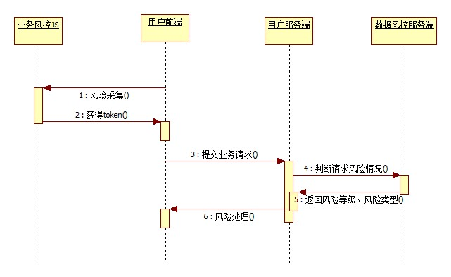
  - 以下摘自知乎（链接[https://www.zhihu.com/question/37572783](https://www.zhihu.com/question/37572783)）：

> **Step 1：**在Web前端周期性的对Javascript代码进行混淆和并更新加密算法，将不可信的Web前端打造成可信的客户端。在用户进行滑动操作时，基于可信的客户端采集用户操作的行为信息以及环境信息，将其加密后提交给后端的风控引擎；

> Web前端虽然没有客户端防止逆向和调试的安全强度，但是却具备客户端所不具有的hotpatch能力。

> 参考Map-Reduce的原理，单台机器性能不行，把任务分派到多台机器并发执行。如果单份Javascript混淆的强度不可行，那么周期性的对Javascript代码自动混淆。即便攻击者能够短时间的对Web前端进行逆向，但逆向出来的功能短期之后就会在服务端失效，那么也能极大的消耗攻击者的成本。

> 如果代码逻辑不更新，仅仅重复的混淆原有逻辑，那么仍然没有意义。而对于一个Web的验证码应用，核心功能只有两部分：
 1.事件采集模块，采集用户的行为信息，此部分逻辑简单，也无法自动化更新代码逻辑；
 2.行为数据加密模块，该部分的核心是加密算法，似乎代码逻辑自动化更新变化有足够空间。

> 为了保障前端的可信，需要对加密算法进行自动化更新，必须要有一个巨大的对称加密算法可选集合才能保证代码的自动化更新。而所有对称加密算法都基于Feistel分组密码结构，基于Feistel分组密码结构可以派生出无数的对称加密算法，从而可以派生出无数的的对称加密算法。

> Festel分组结构的可逆性不要求加密的核心函数F可逆，故可以自动的生成任意的F函数进而派生出无数对称加密算法。基于自动化的代码更新及混淆机制从而保障整个Web代码对抗逆向分析和调试的强度，进而将不可信的Web前端打造成可信的端。

> **Step 2：**后续风控引擎会基于用户操作的行为特征、用户环境信息、用户对应的设备指纹及其设备信誉综合进行决策，判断是否需要对该次操作进行二次判断或者是直接阻断。


#### 通讯过程

- 极验验证/网站主/客户浏览器三方的通讯时序图

     - 浏览器请求网站主页面
     - 网站主请求极验服务器做心跳检测
          - 判断极验SAAS服务是否正常
          - 获取必要的验证初始化工作
     - 极验心跳反馈
     - 启用正常（或者启用failback防宕机机制）
     - 页面初始化验证模块
     - 用户交互，浏览器上传行为数据到极验
     - 极验服务器分析给出结果到浏览器客户端
     - 浏览器提交数据到客户服务器
     - 客户端服务器使用SDK二次验证
     - 给出页面响应操作

     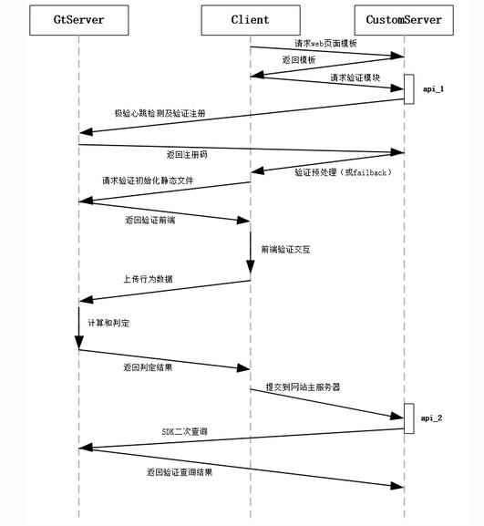

- 在用户表单提交时，会额外提交三个字段，分别是 **geetest_challenge**, **geetest_validate**, **geetest_seccode**, 利用这三个字段，可以重新核对操作是否合法。


#### 优点
  - 用户体验：无知识型验证码针对大多数的用户能够无需思考，直接通过。不存在业务和流程的打断，体验流畅，对用户体验的提升毋庸质疑。
  - 风险识别：基于人类的固有行为特征以及操作的环境信息综合进行风控决策，攻击者难以批量的模拟出可以欺骗风控引擎的正常人类的的操作。
  - 风险拦截：普通的验证码基于知识对机器发起挑战，无法做到对机器进行阻断。因为知识的挑战还需要兼顾人类的体验，机器通过的概率只能做到无限的降低而无法消除。而无知识型验证码基于后端的风控决策，可以对不同风险的操作提出更高难度的验证码乃至阻断，有更大空间对风险进行消除和拦截。


#### 劣势

- 前端信息采集加密对抗较弱
- 缺乏二次验证机制
- 更方便机器模拟验证过程进行破解


#### 破解过程

- 模拟点击动作，触发滑动验证码图片出现。保存，名为fullbg
    - 下载的图片并不是原图，而是由多个切分后的图片拼接而成。在网页上显示时是通过css的background-position属性对图片进行还原。

        - 以bilibili网站登录页面为例，查看网页元素可以直接得到验证图片,及每一小块的偏移量。每次图片打乱的规律相同，且未经过加密。通过简单的固定的图片裁剪拼接即可还原。

             - 验证图片 https://static.geetest.com/pictures/gt/ec93bce96/bg/4fe853147.webp

            

             - 每一小块图片的偏移量

            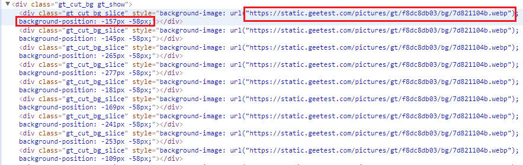

- 模拟稍微移动滑动按钮，触发滑块出现。此时的图片存在滑块阴影空缺。保存，名为bg


- 比较两图片的像素差异即可得到最终滑块最终停止位置

- 如果没有fullbg，只需多次比较不同的bg，通过求交集亦可以获得最终滑块停止位置

- 模拟偏移过程
    - 移动不能太快，也不能完全匀速，需要与真实用户的行为相近

    - 可以采集真实的鼠标移动数据进行模拟

    - 可以利用selenium进行模拟，具体参考[geetest滑动验证码破解成果](https://github.com/darbra/geetest)

    - 可以通过长周期小振幅的正弦函数模拟移动轨迹的y值，x值利用滑块最终停止位置确定生成的帧数不均匀增加。t随时间产生不均匀增加，并加入跳变。以此生成移动轨迹

    - 例，用以下代码进行模拟。摘自[破解极验(geetest)验证码-CSDN](http://blog.csdn.net/paololiu/article/details/52514504)

     ```java

    # 鼠标点击元素并按住不放
    print "第一步,点击元素"
    ActionChains(driver).click_and_hold(on_element=element).perform()
    time.sleep(0.15)

    print "第二步，拖动元素"
    track_string = ""
    for track in track_list:
    track_string = track_string + "{%d,%d}," % (track, y - 445)
    # xoffset=track+22:这里的移动位置的值是相对于滑动圆球左上角的相对值，而轨迹变量里的是圆球的中心点，所以要加上圆球长度的一半。
    # yoffset=y-445:这里也是一样的。不过要注意的是不同的浏览器渲染出来的结果是不一样的，要保证最终的计算后的值是22，也就是圆球高度的一半
    ActionChains(driver).move_to_element_with_offset(to_element=element, xoffset=track+22, yoffset=y-445).perform()
    # 间隔时间也通过随机函数来获得
    time.sleep(random.randint(10,50)/100)
    print track_string
    # xoffset=21，本质就是向后退一格。这里退了5格是因为圆球的位置和滑动条的左边缘有5格的距离
    ActionChains(driver).move_to_element_with_offset(to_element=element, xoffset=21, yoffset=y-445).perform()
    time.sleep(0.1)
    ActionChains(driver).move_to_element_with_offset(to_element=element, xoffset=21, yoffset=y-445).perform()
    time.sleep(0.1)
    ActionChains(driver).move_to_element_with_offset(to_element=element, xoffset=21, yoffset=y-445).perform()
    time.sleep(0.1)
    ActionChains(driver).move_to_element_with_offset(to_element=element, xoffset=21, yoffset=y-445).perform()
    time.sleep(0.1)
    ActionChains(driver).move_to_element_with_offset(to_element=element, xoffset=21, yoffset=y-445).perform()

    print "第三步，释放鼠标"
    # 释放鼠标
    ActionChains(driver).release(on_element=element).perform()

    ```


#### 参考链接
- [淘宝滑动框验证实现原理？](https://www.zhihu.com/question/37572783)
- [极验验证可以被破解吗？-知乎](https://www.zhihu.com/question/28833985)
- [豆瓣登陆验证码的识别脚本](https://www.v2ex.com/t/138479)
- [极验(Geetest) Laravel 5 集成开发包，让验证更安全-Laravel学院](http://laravelacademy.org/post/5291.html)
- [破解极验(geetest)验证码-CSDN](http://blog.csdn.net/paololiu/article/details/52514504)
- [Laravel Geetest](https://github.com/Germey/LaravelGeetest)

### 语音验证
#### 原理
用户点击后触发语音平台对用户号码发起呼叫，电话接通后，再播放验证码语音，用户将听到的语音输入到平台验证码输入框即可完成验证。至于语音验证码平台，由业内专业的验证码服务商提供即可，不用企业自己去搭建，通过验证码平台服务商直接调接入验证码接口即可。
#### 识别流程
触发语音认证->发送语音识别->返回识别结果->填入完成验证
#### 实现方式
*  **页面播放方式**：通过网站添加播放器将验证码以语音方式播放出来。主要为满足特殊人群对验证码识别的问题。
* **通讯方式** ：通过通讯方式直接呼叫预留电话获取验证码。较上一种方式，良好的解决了操作终端对音频设备的依赖，且更加私密，安全性高。
* **绑定电话**：用网站功能直接通过绑定电话接听验证码。较前两种方式，这种流程验证范围更加广泛，更可作为替代时下流行的短信验证方式。

#### 需求分析及优势
* **提高用户体验**：语音验证码目前多用于平台确认客户信息时的一种验证方式。因为一般情况下，通用的短信验证码在平台与目标客户沟通时有可能因出现各种原因发生用户接收不到的情况，那么在这种情况下，如何有效的解决用户在接收不到短信验证码的情况下提供另一种验证方式呢，那么语音验证码可以给用户多一种选择，大大减少客户在接受不到验证码之后出现的一些状况，增强用户体验。

* **降低人工成本**：目前市面上大部分语音验证码都已经实现自动触发，自动拨号功能，智能化提高效率，节省人工成本。

* **覆盖率广**：目前语音验证码是由短信平台与三大运营商互通互联，全国覆盖，通过语音电话直接拨号到用户手机，实现电话语音播报的方式。

* **解决用户接听问题**：如果语音验证码在拨打时手机处于接听电话或于关机状态，系统将会在手机实现正常后自动重播，确保能够让网站用户或是会员收到验证码，从而让用户能够更好的体验目标网站，有助于提高网站的满意度和知名度。语音验证码的出现解决了用户可能因各种原因接受不到验证码的问题，保证了验证信息100％的触达用户，为用户带来了更好的使用体验，也给网站管理者营造了更轻松更高效的运营环境。

#### 应用场景
语音验证码目前在登陆注册这一块的应用还不太广泛，已知的语音客户有美团、饿了么、滴滴、容联云通讯、易到用车、百姓网等，目前的应用场景也仅限于登陆注册，而且大多还是与短信验证码配套使用。这是为最大限度地保障用户注册体验，避免一些潜在的注册用户基于某种原因短信验证码难以到达的情况下的另一种选择，最大程度的避免损失用户，另外就是防止刷单。

#### 应用前景
据统计，国内目前每年年消耗的验证码约1300亿条，90%以上的验证需求是采用短信通知的形式来满足，而如今的电信短信诈骗频发以及手机APP中的第三方软件例如：360手机管家、腾讯手机管家等进行陌生短信的自动拦截，或被用户无意忽视，或由于通信原因无法到达。使得语音验证码相比短信验证有着更大的优势，虽然从目前来看，短信验证码仍旧是业内主流的验证方式，但作为未来的发展趋势，语音验证码必将从目前的补充地位，逐渐向市场主流趋势演变。


### 接收短信验证码
#### 原理
短信验证码是通过发送验证码到手机的一种有效的验证码系统。某些验证码接入商提供手机短信验证码服务，网站通过接口发送请求到接入商的服务器，服务器发送随机数字或字母到手机中，由接入商的服务器统一做验证码的验证。

短信验证码常见于注册，忘记密码，确认下单等阶段，特别是一些涉及到用户个人敏感行为时候，为了确认操作是用户本人执行的通常会使用短信验证码进行二次认证。同时，短信验证码也是最为常见的验证码类型之一

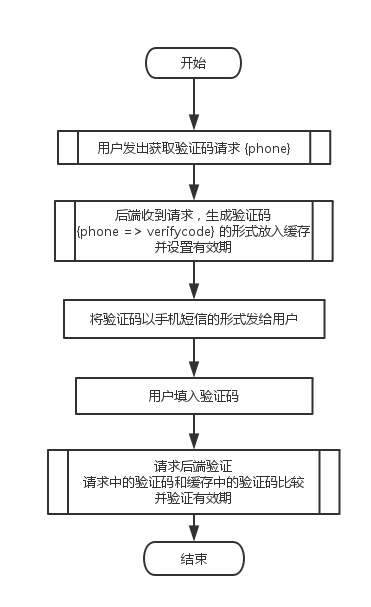
#### 识别流程
触发短信认证——>发送验证码——>返回识别结果——>填入完成验证
#### 实现原理
1. 手机短信验证码是OTP【one time password】的一种实现方式：挑战/应答方式；
2. 挑战应答方式：挑战：后台下发一条随机码X。应答：网页客户端通过算法（例如MD5）将用户信息和随机码X合并，经处理后生成一条字符串Y，并返回给后台；
3. 后台用同样的算法处理这条随机码X和后台存储的用户信息，得到一条字符串Z。后台比对来自客户端的字符串Y和自己生成的字符串Z，如果两者一致，则确认用户身份或交易结果。

#### 接口实现
短信接口一般支持http和webservice调用。程序员在需要发送短信的地方添加接口地址和相关参数，如接收端手机号码、接收的内容以及其他接口参数，调用完就会返回xml数据，表示成功提交或者失败。关于回复短信，会绑定到一个接收回复内容的地址，有短信回复过来就推送到对应地址。
#### 使用范围
短信验证码是目前使用最广泛的一种验证方式，目前使用的最普遍的有各大银行，网上银行，网上商城、团购网站、票务公司等，他们利用短信验证码来注册会员，大大降低了非法注册，烂注册的数据。

#### 逻辑漏洞
- 接口没设频次上限导致短信轰炸

  - 起因：短信轰炸问题往往出现在一些小站或者子站，目前基本都是使用POST请求发送短信验证码，使用抓包软件可以重放请求对于后端没有做限制的网站就可以达到短信轰炸的效果。

  - 危害：对用户来说个人生活受到骚扰，对企业来说造成一定的负面影响，很多小公司因为短信接口被大量调用出现运营问题，对于公司没有安全工程师的情况下，一般都是业务方发现数据异常向上汇报，最后和开发人员一起反溯才会找到问题，而在这段时间中企业所损失的资金也是无法挽回的。

  - 预防：这里主要是针对两种攻击场景来进行防御。（第一种是对单用户的短信轰炸，即重放发送请求且phonenum为一个值。第二种是对多用户发送短信骚扰的场景，即将phonenum参数设置为字典，重放短信接口。）
设置发送间隔。即单一用户发送请求后，与下次发送请求时间需要间隔60秒。
设置单用户发送上限，即设置每个用户单位时间内发送短信数的上限，如果超过阈值就不允许今天再次调用短信接口(阈值根据业务情况设置)。
设置单IP发送上限。（针对第二种攻击场景），由于IP的特殊性可能存在所处IP是大出口，一旦误杀后果会很严重，所以这个限制根据自身情况酌情考虑，对于有风控的团队来说，当发现发送IP存在异常可以对该IP增加二次认证来防止机器操作，也可以降低误杀情况。
- 验证码内容包含在返回包中

  - 起因：因为开发不严谨导致通过抓包可以看到验证码在回显中显示。


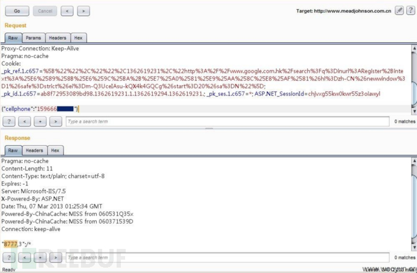

  - 危害：由于验证码直接返回，通过该漏洞可以注册任意用户，重置已注册用户密码，修改绑定信息等高危操作，对用户造成一定影响。

  - 预防：不要将短信验证码在回显中显示，验证码只存于服务端中并不能通过任何api直接获取。

- 修改返回包内容绕过验证

  - 起因：前段校验不严格

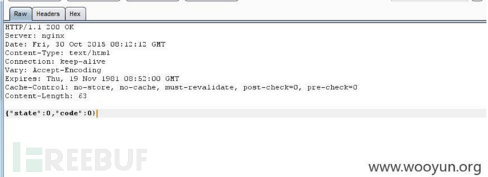

   - 危害：可跳过正常校验逻辑

  - 预防：服务端严格做检验，配合开发人员减少逻辑漏洞

#### 安全性分析

##### 预设
- 认为用户的手机卡是不会轻易丢失和被窃取的，和用户绑定更紧密。（相对于各种脱库事件，密码泄露的概率要大于丢失手机的概率，且手机丢失有补救措施即可以立即去运营商挂失补卡，而密码泄露无可挽回）

- 认为有手机号可以做二次验证的用户是真实用户（因此手机验证码通常也会在要求比较高的场合被用来作反垃圾注册，并且能获得更多用户的真实信息）

- 认为运营商维护的通讯信道比其他的都更安全（此预设基本上是可信的），但是在智能手机普及的大环境下各类短信木马此起彼伏，补卡攻击和无线电监听这些一直存在的问题也被关注和利用，因此短信验证的安全性就开始出现了问题。

##### 威胁
- 非手机持有者接触

   如手机的丢失、窃取或在未设置密码时被人接触等。

- 智能手机平台上的短信木马
   这种木马的作用之前广泛用于支付宝诈骗，不法分子诱骗受害者通过二维码下载安装木马，随后重置受害者的支付宝、淘宝账户盗取钱财。因为之前支付宝的重置密码验证只通过短信验证码，木马在后台可以轻易窃取并转发给不法分子，实现对受害者的账号重置。这类木马编写简单，已经形成了非常完整的产业链：从制马人员到售马、租马，到实施钓鱼、欺骗、洗号、转移钱财。在智能手机的年代，由于OS开放了短信操作和拦截的接口（Android直接提供，iOS需要越狱），对于一个安装了支付类App的智能手机且绑定账户的SIM卡也安装在同一个手机的情况（绝大部分情况下是这样），短信验证事实上已经退化成了单因子验证，只要智能手机被安装了木马，这些验证体系就会全线崩溃，攻击者甚至可以只通过钓鱼wifi全部截取登陆密码、支付密码和短信验证。
- 补卡攻击、克隆攻击。

  短信验证码事实上是基于手机号（SIM卡/运营商服务）而不是手机设备。因此如果能办一张和受害者相同的手机号（卡），就可以达到克隆的目的——接受受害者的验证码，重置各种账号。参考安卓系统手机绑定银行卡易成黑客“提款卡”，这里的薄弱环节就在运营商，部分地区的运营商对补卡人员身份验证不严导致出现了补卡攻击。在早些年SIM卡构造简单的时候甚至还能直接去克隆一张卡出来。
- 无线电监听。

   这里主要包括GSM监听，包括监听空中短信，直接获取短信内容（此方式成本和范围有限制，相对1、2来说用在真正犯罪的情况下比较少。

##### 解决方案
- 用户自身提高安全防范意识

  - 密码设置

     例如设置手机锁屏码是必须的步骤，防止手机丢失后被直接打开使用，增加犯罪成本。另外还可以给SIM卡设置PIN码（静态密码设置一定要复杂），PIN码初始一般是1234，要注意修改。SIM卡插入任何手机中，只有输入正确的PIN码才能使用，输错3次之后需要验证PUK码，PUK如果再次输错SIM卡就会报废。手机被偷之后请一直呼叫，呼叫至没电或者关机。

     在假定设置了不会被轻易破解的锁屏密码的情况下，针对如下情况：
  - 短信验证：攻击者可能破解失败锁屏密码后就直接取出SIM卡，这种情况下手机丢失后应立即去营业厅或者电话挂失号码。

  - OTP类：这些基于App的验证相对来说比较可靠，但为了提高安全性也需要吊销，以重新生成种子。

  - 遭遇“干扰信息”仔细甄别

      每个人手机上，可能都会出现过各种的干扰信息，那么如果在我们风险意识并不是很强的情况下，很容易被这种干扰信息所误导，就会产生后续的一系列的损失。

  - 手机离奇“瘫痪” 紧急“挂失”当先

    另外，如果手机通讯出现瘫痪，一定要马上查清故障原因。如非手机本身或信号故障，要立刻挂失手机卡，并及时冻结第三方支付和银行账户，避免攻击者趁用户处于"信息孤岛"时，冒名顶替机主身份窃取账户。

  - 短信验证码 不能告诉任何人！

    最最重要的是：短信验证码不要告诉任何人！电信运营商和提供相关服务的企业只会将短信验证码下发给用户，绝对不会要求用户通过短信或电话进行所谓“回复验证码”的操作。
  - 不要安装来路不明的应用

    建议只安装手机品牌商店中的应用（起码安全性要高一些）
- 系统开放度

  短信木马的情况有很大部分其实是反木马和系统开放度的问题，Android在4.4之后已经收紧了短信权限，目前4.4及之后版本普及之后情况有一定好转。

- 运营商维护的安全信道

  补卡攻击和克隆攻击依赖于运营商的各大营业厅加强安全意识，随着安全性意识的增强，目前在营业厅的补卡行为盘查的较为严格，补卡和克隆攻击情况有所缓解。

  无线电监听情况可以考虑使用CDMA、3G、4G等更安全的信号通道，但目前也有降维攻击，强制将用户信号降为（2G）GSM之后进行监听。这种攻击的防御主要是使用非GSM制式的通讯服务，等待GSM退出历史舞台。
#### 总结
短信并不是最好的二次验证方法，但却是成本最低最容易实现的验证方法：用户绑定性较强，不需要额外设备，用户广泛拥有，校验成本极低。在没有设计缺陷的情况下，在密码认证之外添加短信认证是同时使用了第一类和第二类认证，也即强认证。在密码设置合理（严格来说必须用随机数，或大小写、数字、特殊字符混合的便于记忆型数据）、手机短信验证码系统可靠（在不被人复制窃听）的情况下，安全性是有充分保证的。即使是两种认证方式终有任何一种被破坏，面对一般的威胁时，综合考虑成本和适用性的情况下，短信验证码在目前来说安全性不算很低。


#### 参考链接
- [验证码安全那些事](http://www.freebuf.com/articles/rookie/131542.html)
- [知乎：通过手机短信验证码验证身份，真的安全吗](https://www.zhihu.com/question/24173904)

### 上行短信验证（编辑指定短信内容发送到指定号码）
#### 原理
- 用户主动发送短信给通信服务提供商以定制某种服务、完成某种查询或办理某种业务

#### 操作过程

- 运行商获取用户手机号
- 后端生成验证码，将验证码和手机号存入缓存，并设置过期时间
- 将生成的验证码和短信接收号码以HTTP形式发送给用户
- 用户将验证码发送给指定的接收号码
- 运营商收到用户发回的短信之后，调用回调URL验证用户的发送内容，内容符合要求后更新缓存中的标记，设置为验证成功
- 客服端检测用户的缓存标记是否为验证成功，成功则继续执行操作

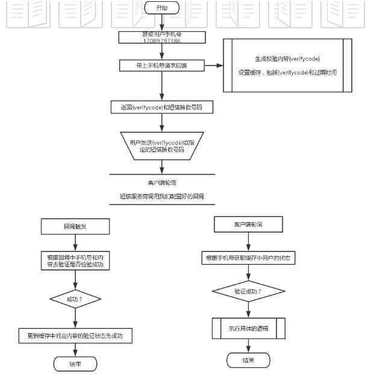

#### 应用场景举例

- CSDN用户注册
- 中国建设银行查询余额

#### 优势

- 受网络的影响较小，可以改进下行短信验证中用户收不到短信或延迟时间长的情况

#### 用户体验

- 需要用户自己编辑短信，操作的方便程度不如下行短信验证
- 需要用户承担上行短信的费用
#### 安全性分析
以[秒嘀科技](http://www.miaodiyun.com/doc/service_MO.html)的上行短信请求实例为例：


    POST /配置的回调地址
    Accept:application/json
    Content-Type:application/json;charset=utf-8

    {
    "MOPort": "6985",
    "phone": "138xxxxxxxx",
    "content": "content",
    "MOTime": "2015-06-29 19:23:26",
    "timestamp": "1435897700379",
    "sig": "23fbdb3d590cf755afcfe4b197099554"
    }

请求方式：POST

支持格式：JSON

请求参数说明：

- **MOPort** 分配给开发者的上行短信端口
- **phone**  上行手机号码
- **content**  上行短信内容
- **MOTime**  上行短信时间
- **timestamp**  时间戳。当前系统时间（24小时制），格式"yyyyMMddHHmmss"。时间戳有效时间为5分钟
- **sig**  签名。MD5(ACCOUNT SID + AUTH TOKEN + timestamp)。共32位（小写）


相对上行短信，下行短信被攻击者直接获取对验证结果无直接影响。

下行短信的请求参数里包括时间戳与签名。时间戳与用户标识、用户身份令牌组合，经过MD5算法生成哈希签名发送给接收方。时间戳精确到秒，且5分钟有效。

当中间人拦截到此上行短信，在短时间内也无法进行哈希碰撞产生伪造的签名。从而无法伪造上行短信。因此上行短信在伪造方面是安全的。

但上行短信同下行短信一样，可能受到补卡攻击或克隆攻击。如果攻击者办一张和受害者相同的手机号（卡），就可以达到克隆的目的——接受受害者的验证码，以受害者的身份进行上行短信验证。

#### 安全性测试

依然用秒嘀科技网站测试。进行注册。
注册页面URL为不安全链接

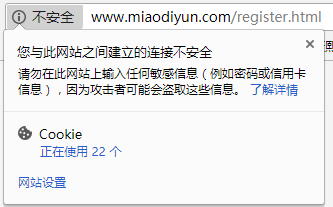

填写邮箱手机号后，点击发送短信验证码按钮，网页会发送一条请求，返回用户输入信息，发送验证码。
可以看到用户信息以明文形式发送。

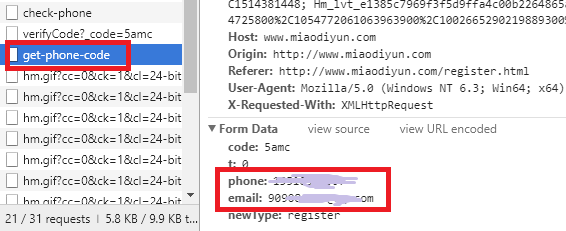

接收到6位验证码后，如果输入位数错误的验证码，前端会进行校验，提示错误信息

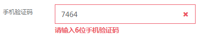

这个网站很诡异的一点是，我收到的验证码为

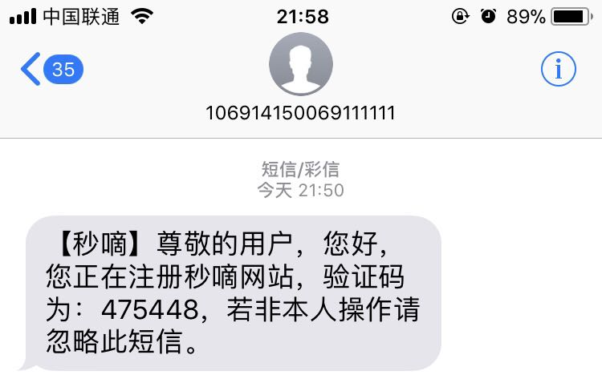

但是实际在网页中输入任何六位数字都可以通过

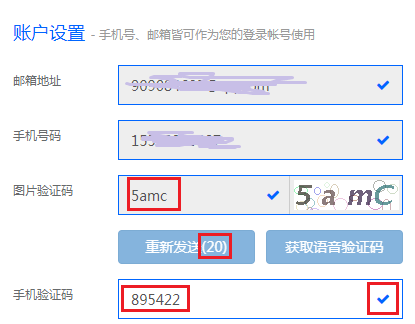

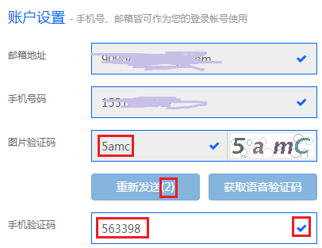

等待重新发送时间结束，请求获取语音验证码时，之前的图片验证码会进行刷新，提示图片验证码错误。

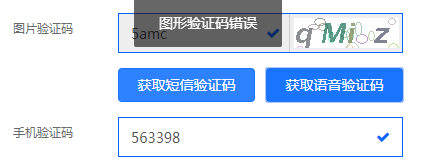

但是图片验证码输入框却不允许再次进行输入。从而无法获取语音验证码。只能刷新后重新输入信息，直接点击获得语音验证码。

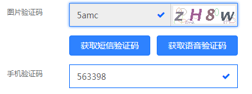

但是在测试中，请求获取语音验证码后并未收到来电。等待重新发送时间结束，请求重新发送时，又出现了图片验证码刷新无法再次输入的问题。（这个网站真的莫名其妙。。）

#### 参考链接

- [短信验证——上行和下行](https://www.cnblogs.com/iforever/archive/2016/08/04/5736142.html)


### 电话回拨验证

#### 出现背景

- 不法分子窃取语音验证码冒充用户身份进行诈骗行为
- 不法分子通过非法渠道获取用户客服密码
- 通过网厅将用户来话呼转至不法分子号码
- 不法分子呼转用户电话后，冒充其身份完成消费操作

#### 原理

- 用户主动参与的语音呼叫号码验证方式

#### 流程

- 拨打验证业务平台给待验证用户随机分配一个临时号码X
- 用户通过已注册手机主动呼叫拨打验证业务平台提供的临时号码
- 拨打验证业务平台接受用户呼叫，开展双重验证
- 获取用户手机号码，验证是否与已注册手机号码一致
- 对来话信令进行全方位跟踪分析，验证来话真实性，有效识别改号软件

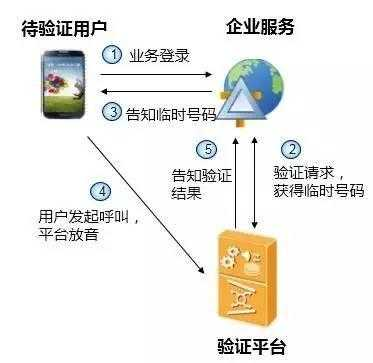

#### 优势

- 用户主动发起，刷单门槛较语音验证码有显著提高
- 独有的信令分析技术，充分验证用户真实性
- 避免被非法获取，安全性更高

#### 安全性保证

- 只有从真实终端始发，中间不存在呼转的正常信令路由用户，平台才会将其验证
为真实的用户。
- 如果是不法分子刷单或使用改号软件，信令路由会和终端发起不同，
平台会将其验证为非正常用户

#### 参考链接
- [如何用开发手段 规避利用语音验证码漏洞的电信欺诈](https://zhuanlan.zhihu.com/p/29325169)


### 语音验证码相比短信验证码应用优势
1. 账号更安全

    用户绑定了手机或固话，只可用绑定过的号码拨打指定电话并获取随机密码，才可以进行登录或转账等一系列的操作。 在目前的网站上，使用语音验证码的企业数量不断增加，一般都是用于平台确定客户的信息。在账号登录或者转账等业务需要播报验证码的时候，语音验证码就可以起到很好的作用。短信验证的方式会受手机木马、信息泄露等的影响，使得验证失败，财产丢失。手机验证码短信要求核实方必须是个真实的用户，而语音验证码的出现防止刷单且更加安全。

2. 用户信息更真实

   只有通过验证的用户才可以注册，这样保证了用户的联系信息资料的100%的准确性。

3. 覆盖范围更广。

   一般情况下，短信验证码是大众所常用的一种验证方式，但要保证短信的到达率和及时性是一个复杂的问题，而短信验证码并非每次都可以满足这个时效性，语音验证码的出现给大家带来了一种新的体验，，当短信不稳定或者下发未达的时候，语音验证码会进行二次下发，保证了验证信息的高效传播，可以保证整个流程顺利进行。

4. 用户体验度更高。

   随着智能手机普及，用户更换手机的频率增加，但是更换手机即意味着新手机上相关账号的登录，而此时就需要验证身份，通过手机发送验证申请后不到5秒，就接到来自106开头电话，接听后竟然在播报验证码。马上输入，完成注册，整个流程下来不到一分钟。而语音验证码是通过电话直呼，将验证码播报给用户，完美解决了用户因各种问题导致不能及时接收到验证码的难题，提高了用户体验度。此外，还可以根据公司、网站、电商、游戏等行业性质、领域的不同，定制个性化语音提示及验证码类型。

5. 防刷单更有效

   语音验证的价格是短信的十倍。很多公司不会对17开头的虚拟号段进行发送的，为此卡商提供的卡号基本是实名认证的且没有停机的正常号段，所以收语音验证的成本就会比短信高很多。

### 安全性分析

   一般语音验证方式用于登录、注册场景，和短信验证码配合使用，因此在这种情况下，直接破解方式较难，要牵涉到语音识别技术，绕过破解时语音验证的安全性依赖于用户手机端的安全性，分析同[密码设置](https://github.com/15xinanwzy/ns/blob/master/2017-2/wyq_wzy_lw/%E5%A4%A7%E4%BD%9C%E4%B8%9A/%E7%9F%AD%E4%BF%A1%E9%AA%8C%E8%AF%81%E7%A0%81%E5%AE%89%E5%85%A8%E6%80%A7%E5%88%86%E6%9E%90.md)。
