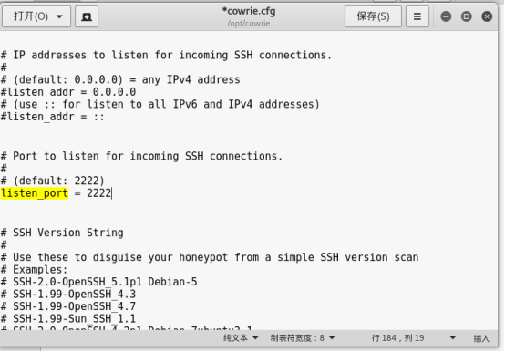
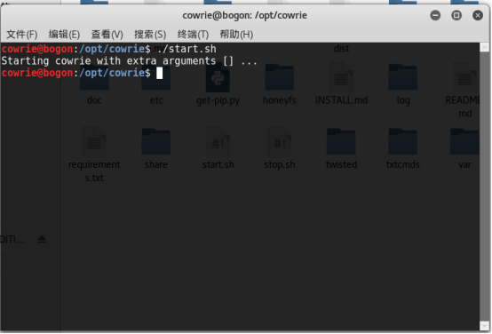

# 入侵cowrie蜜罐流程

### 一，蜜罐主机下文件更改以及相关设置
- 编辑cowrie.cfg文件 设置监听端口为默认2222

- 将interact_enabled = false改为true 后保存

- 在cowrie用户下开启蜜罐

    `./start.sh`

- 实时监视日志文件

    `tail  -f  log/cowrie.log`

### 二，在攻击机进行入侵行为
- 使用nmap探测端口的服务类型/具体版本等信息，适用于内外网的探测，以内网操作为示例

    `nmap -sV 10.0.2.14`

- 使用 SSHBruteForce.py 脚本进行暴力攻击（手动创建用户名字典和密码字典，这里只是为了演示，只加了几个用户名和弱口令。真正破解时，需要利用密码字典生成器生成强大的字典）

    `python ./SSHBruteForce.py -i 10.0.2.14 -d True -U user.txt -P pass.txt -p 2222`

由图片可知道攻击者尝试对一个主机（即我们预先设置好的蜜罐）进行暴力破解并破解成功得到了对应IP地址的用户名和密码

- 对破解后的用户进行远程登录

     `ssh 10.0.2.14 -l root -p 2222` 

由上图可知攻击者成功登录了我们预先设下的蜜罐，其实是自己进入了别人设下的陷阱

- 尝试查看入侵主机中的信息和文件等

### 三，在日志文件对攻击者的入侵行为实时观察

